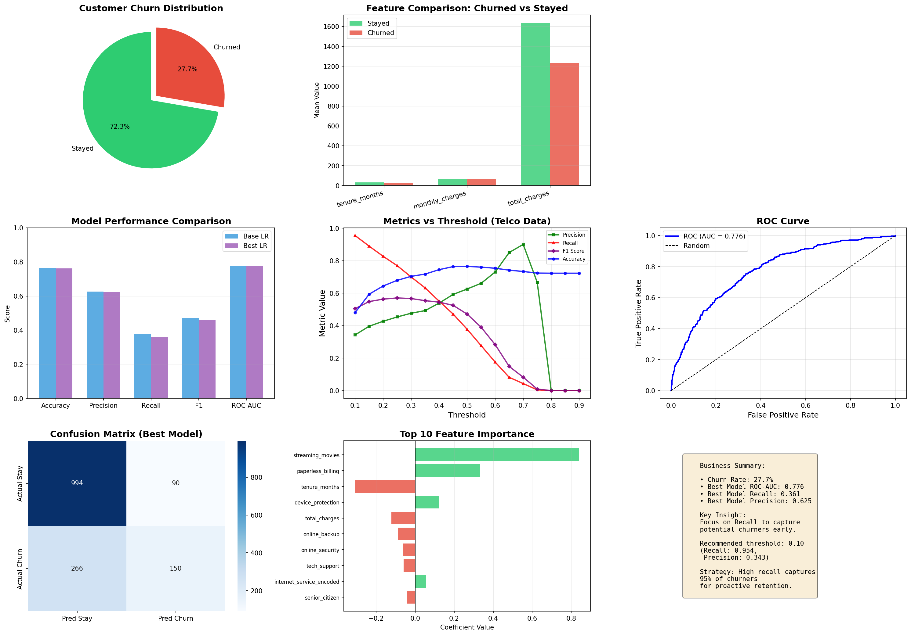

# Week 15: 真实数据挑战报告 - 电信客户流失预测

## 1. 数据概述

### 1.1 数据来源
模拟电信客户流失数据

### 1.2 数据规模
- **总样本数**: 5000
- **特征数**: 15
- **流失率**: 27.7%
- **流失客户数**: 1386
- **留存客户数**: 3614
- **类别不平衡比**: 2.61:1

## 2. 模型训练与评估

### 2.1 模型性能对比

| 指标 | 基础 LR | 最佳 LR (GridSearchCV) |
|------|---------|------------------------|
| Accuracy | 0.7647 | 0.7627 |
| Precision | 0.6255 | 0.6250 |
| Recall | 0.3774 | 0.3606 |
| F1 Score | 0.4708 | 0.4573 |
| ROC-AUC | 0.7769 | 0.7758 |
| Log Loss | 0.4895 | 0.4911 |

**最佳模型参数**: {'C': 0.1, 'penalty': 'l1', 'solver': 'saga'}
**最佳 CV ROC-AUC**: 0.7699

### 2.2 混淆矩阵（最佳模型，默认阈值 0.5）

|  | 预测留存 | 预测流失 |
|------|----------|----------|
| 实际留存 | TN = 994 | FP = 90 |
| 实际流失 | FN = 266 | TP = 150 |

## 3. 业务问题回答

### 3.1 单看 accuracy 会不会误导判断？

**会。** 在流失率仅 27.7% 的情况下，如果模型简单预测所有客户"不会流失"，accuracy 就能达到 72.3%，但这样的模型毫无业务价值。

### 3.2 更信任哪个指标？为什么？

最信任 **F1 Score（配合 Recall 和 ROC-AUC）**：
- F1 Score 平衡 Precision 和 Recall
- ROC-AUC 评估模型排序能力
- Recall 直接关系到能挽回多少流失客户

### 3.3 向业务方解释：强调"类别"还是"概率"？

**推荐强调"概率"**：概率提供更丰富的信息，支持灵活的分层策略。

**推荐业务阈值**: 0.10（Recall = 0.9543）

## 4. 可视化分析

