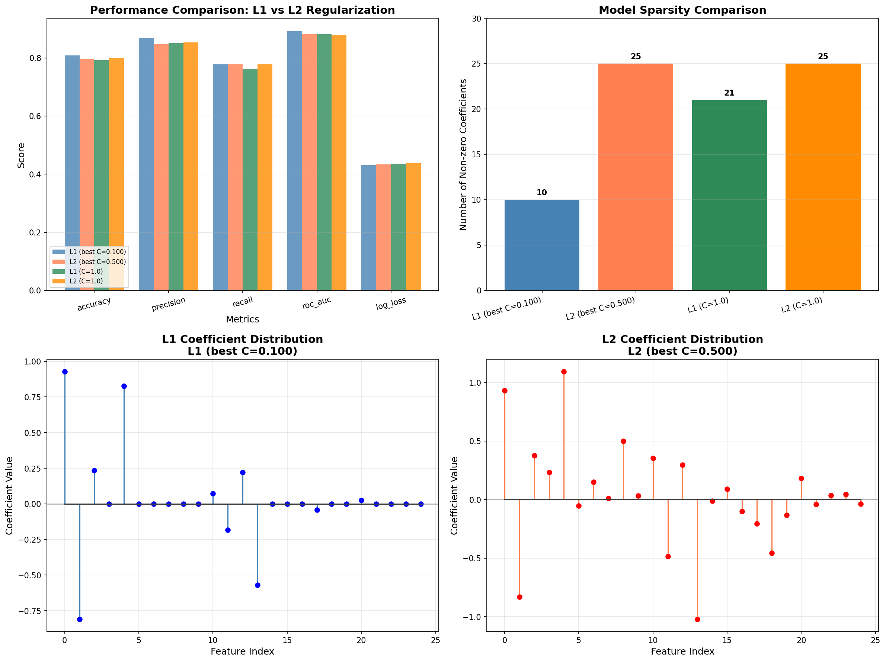

# Week 15: L1 vs L2 正则化逻辑回归报告

## 1. 实验设置
- 样本量: 800，特征数: 25
- 真实有效特征: 5
- GridSearchCV (5折) 选择最佳 C
- **L1 最佳 C**: 0.100 (CV ROC-AUC: 0.8897)
- **L2 最佳 C**: 0.500 (CV ROC-AUC: 0.8826)

## 2. 实验结果

| 模型 | Accuracy | Precision | Recall | ROC-AUC | Log Loss | 非零系数个数 |
|------|----------|-----------|--------|---------|----------|-------------|
| L1 (best C=0.100) | 0.8083 | 0.8678 | 0.7778 | 0.8918 | 0.4311 | 10 |
| L2 (best C=0.500) | 0.7958 | 0.8468 | 0.7778 | 0.8812 | 0.4334 | 25 |
| L1 (C=1.0) | 0.7917 | 0.8512 | 0.7630 | 0.8814 | 0.4351 | 21 |
| L2 (C=1.0) | 0.8000 | 0.8537 | 0.7778 | 0.8781 | 0.4379 | 25 |

## 3. 核心问题回答

**Q1: L1 和 L2 的预测表现差很多吗？**
不差很多。两者在主要指标上非常接近。

**Q2: 哪一个模型更稀疏？**
L1 明显更稀疏，能将不重要特征的系数压缩为 0。

**Q3: 哪个模型更适合"给出一个更短的变量名单"？**
L1 正则化，因为它直接产生特征选择效果。

**Q4: 如果业务方更在意模型稳定性？**
推荐 L2，系数更平滑，对数据波动不敏感。
