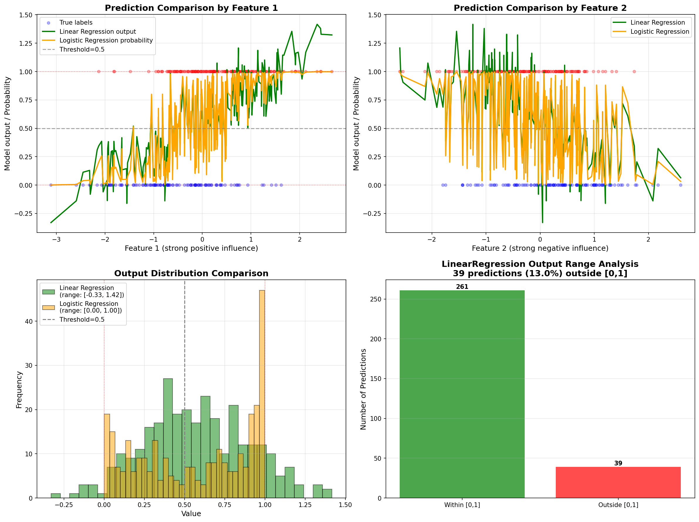
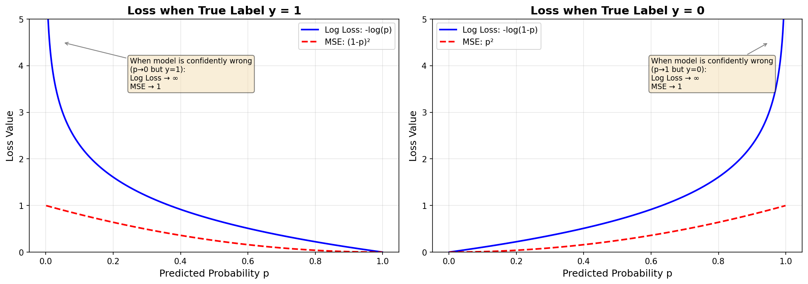

# Week 15: 逻辑回归模拟数据报告

## 1. 数据生成机制 (DGP)

### 1.1 数据规模
- 样本量: 1000
- 特征数: 4
- 正类比例: 0.587

### 1.2 特征设计
| 特征 | 真实系数 | 影响方向 | 说明 |
|------|----------|----------|------|
| feature_1 | 2.0 | 正向 | 强正向影响，提高正类概率 |
| feature_2 | -1.5 | 负向 | 强负向影响，降低正类概率 |
| feature_3 | 0.5 | 正向 | 弱正向影响 |
| feature_4 | 0.0 | 无 | 噪声特征 |

### 1.3 生成公式
η = 0.5 + 2.0 × X1 - 1.5 × X2 + 0.5 × X3
p = 1 / (1 + exp(-η))
y ~ Bernoulli(p)

## 2. 模型对比：LinearRegression vs LogisticRegression

### 2.1 核心对比图

**图中内容说明：**

**左上图 - 按 Feature 1 的预测对比：**
- 横轴：feature_1（强正向影响特征）
- 纵轴：模型输出值 / 预测概率
- 红色散点：真实标签 y=1（正类）
- 蓝色散点：真实标签 y=0（负类）
- 绿色曲线：LinearRegression 的预测输出（可看到超出 [0,1] 范围）
- 橙色曲线：LogisticRegression 的预测概率（严格在 [0,1] 内）

**右上图 - 按 Feature 2 的预测对比：**
- 横轴：feature_2（强负向影响特征）
- 其余元素同上

**左下图 - 输出分布对比：**
- 绿色直方图：LinearRegression 输出分布
- 橙色直方图：LogisticRegression 输出分布

**右下图 - 超出 [0,1] 范围的预测统计：**
- 绿色柱：在 [0,1] 范围内的预测
- 红色柱：超出 [0,1] 范围的预测

### 2.2 LinearRegression 输出分析
- 最小值: -0.330
- 最大值: 1.416
- 超出 [0,1] 范围的预测数: 39 (13.0%)

### 2.3 核心问题回答

**Q1: LinearRegression 在这个任务里最不自然的地方是什么？**
有 13.0% 的预测值超出了 [0,1] 范围。当模型预测概率为 -0.3 或 1.5 时，这些值无法解释为概率。

**Q2: 为什么逻辑回归的输出更容易解释成概率？**
LogisticRegression 通过 sigmoid 函数将任意实数映射到 (0,1) 区间，值域与概率完全一致。

**Q3: 这里的关键区别是什么？**
关键区别不是"能不能分类"，而是"输出是否有概率意义"。逻辑回归输出的是经过严格概率校准的预测。

## 3. 损失函数分析：Log Loss vs MSE

### 3.1 公式解释（Task B1）

**Bernoulli 分布：** Y ~ Bernoulli(p)
含义：Y 以概率 p 取值为1，以概率 1-p 取值为0。

**单样本 Likelihood：** L(p; y) = p^y × (1-p)^(1-y)
含义：当 y=1 时简化为 L=p，当 y=0 时简化为 L=1-p。它本质上是在写"模型给真实标签分配了多大概率"。

**负对数似然（Log Loss）：** log_loss = -[y × log(p) + (1-y) × log(1-p)]
含义：通过对似然取负对数得到，既方便数值优化，也会对"错得很自信"的预测施加更重惩罚。

### 3.2 损失对比图

- 横轴：预测为正类的概率 p
- 纵轴：损失值
- 蓝色实线：Log Loss
- 红色虚线：MSE

### 3.3 核心问题回答

**Q1: 为什么"错得很自信"需要被重罚？**
因为这类错误不仅分类错了，概率判断也严重失真，在业务上可能导致灾难性后果。

**Q2: 为什么 log loss 来自 Bernoulli likelihood？**
从 Bernoulli 分布出发 → 写似然函数 → 取负对数 → 得到 log loss，整个过程是 MLE 的自然推导。

**Q3: 三者关系？**
sigmoid 确保输出是概率 → Bernoulli 描述数据生成机制 → log loss 是 MLE 导出的优化目标。

## 4. 阈值分析结果

**默认阈值 0.5 下的混淆矩阵：**
- TP: 143, TN: 93, FP: 29, FN: 35

**最佳 F1 阈值: 0.2**

| 阈值 | Accuracy | Precision | Recall | F1 |
|------|----------|-----------|--------|-----|
| 0.10 | 0.7300 | 0.6873 | 1.0000 | 0.8146 |
| 0.15 | 0.7667 | 0.7213 | 0.9888 | 0.8341 |
| 0.20 | 0.7867 | 0.7436 | 0.9775 | 0.8447 |
| 0.25 | 0.7867 | 0.7568 | 0.9438 | 0.8400 |
| 0.30 | 0.7933 | 0.7762 | 0.9157 | 0.8402 |
| 0.35 | 0.8067 | 0.8093 | 0.8820 | 0.8441 |
| 0.40 | 0.8000 | 0.8207 | 0.8483 | 0.8343 |
| 0.45 | 0.7900 | 0.8249 | 0.8202 | 0.8225 |
| 0.50 | 0.7867 | 0.8314 | 0.8034 | 0.8171 |
| 0.55 | 0.7700 | 0.8385 | 0.7584 | 0.7965 |
| 0.60 | 0.7767 | 0.8581 | 0.7472 | 0.7988 |
| 0.65 | 0.7700 | 0.8707 | 0.7191 | 0.7877 |
| 0.70 | 0.7500 | 0.8815 | 0.6685 | 0.7604 |
| 0.75 | 0.7300 | 0.9008 | 0.6124 | 0.7291 |
| 0.80 | 0.7200 | 0.9273 | 0.5730 | 0.7083 |
| 0.85 | 0.6867 | 0.9286 | 0.5112 | 0.6594 |
| 0.90 | 0.6633 | 0.9425 | 0.4607 | 0.6189 |

### 观察到的 Trade-off
当阈值升高时，Precision 通常上升，Recall 通常下降。
