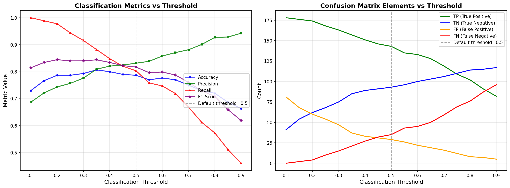

# Week 15: 阈值分析与指标权衡报告

## 1. 混淆矩阵与基础指标

### 1.1 默认阈值 (0.5) 下的混淆矩阵

|  | 预测为正 | 预测为负 |
|------|----------|----------|
| 实际为正 | TP = 143 | FN = 35 |
| 实际为负 | FP = 29 | TN = 93 |

### 1.2 基础指标
- Accuracy = 0.7867
- Precision = 0.8314
- Recall = 0.8034

## 2. Threshold 扫描结果

### 2.1 阈值扫描图

- 横轴：分类阈值
- 纵轴：指标值
- 蓝色：Accuracy，绿色：Precision，红色：Recall，紫色：F1

### 2.2 不同阈值下的指标值

| 阈值 | Accuracy | Precision | Recall | F1 | TP | TN | FP | FN |
|------|----------|-----------|--------|----|----|----|----|----|
| 0.10 | 0.7300 | 0.6873 | 1.0000 | 0.8146 | 178.0 | 41.0 | 81.0 | 0.0 |
| 0.15 | 0.7667 | 0.7213 | 0.9888 | 0.8341 | 176.0 | 54.0 | 68.0 | 2.0 |
| 0.20 | 0.7867 | 0.7436 | 0.9775 | 0.8447 | 174.0 | 62.0 | 60.0 | 4.0 |
| 0.25 | 0.7867 | 0.7568 | 0.9438 | 0.8400 | 168.0 | 68.0 | 54.0 | 10.0 |
| 0.30 | 0.7933 | 0.7762 | 0.9157 | 0.8402 | 163.0 | 75.0 | 47.0 | 15.0 |
| 0.35 | 0.8067 | 0.8093 | 0.8820 | 0.8441 | 157.0 | 85.0 | 37.0 | 21.0 |
| 0.40 | 0.8000 | 0.8207 | 0.8483 | 0.8343 | 151.0 | 89.0 | 33.0 | 27.0 |
| 0.45 | 0.7900 | 0.8249 | 0.8202 | 0.8225 | 146.0 | 91.0 | 31.0 | 32.0 |
| 0.50 | 0.7867 | 0.8314 | 0.8034 | 0.8171 | 143.0 | 93.0 | 29.0 | 35.0 |
| 0.55 | 0.7700 | 0.8385 | 0.7584 | 0.7965 | 135.0 | 96.0 | 26.0 | 43.0 |
| 0.60 | 0.7767 | 0.8581 | 0.7472 | 0.7988 | 133.0 | 100.0 | 22.0 | 45.0 |
| 0.65 | 0.7700 | 0.8707 | 0.7191 | 0.7877 | 128.0 | 103.0 | 19.0 | 50.0 |
| 0.70 | 0.7500 | 0.8815 | 0.6685 | 0.7604 | 119.0 | 106.0 | 16.0 | 59.0 |
| 0.75 | 0.7300 | 0.9008 | 0.6124 | 0.7291 | 109.0 | 110.0 | 12.0 | 69.0 |
| 0.80 | 0.7200 | 0.9273 | 0.5730 | 0.7083 | 102.0 | 114.0 | 8.0 | 76.0 |
| 0.85 | 0.6867 | 0.9286 | 0.5112 | 0.6594 | 91.0 | 115.0 | 7.0 | 87.0 |
| 0.90 | 0.6633 | 0.9425 | 0.4607 | 0.6189 | 82.0 | 117.0 | 5.0 | 96.0 |

**最佳 F1 阈值: 0.20**，F1 = 0.8447

## 3. 业务场景分析（疾病初筛）

推荐使用阈值 **0.10**：
- Recall = 1.0000
- 确保尽量不漏掉真正患病的人
