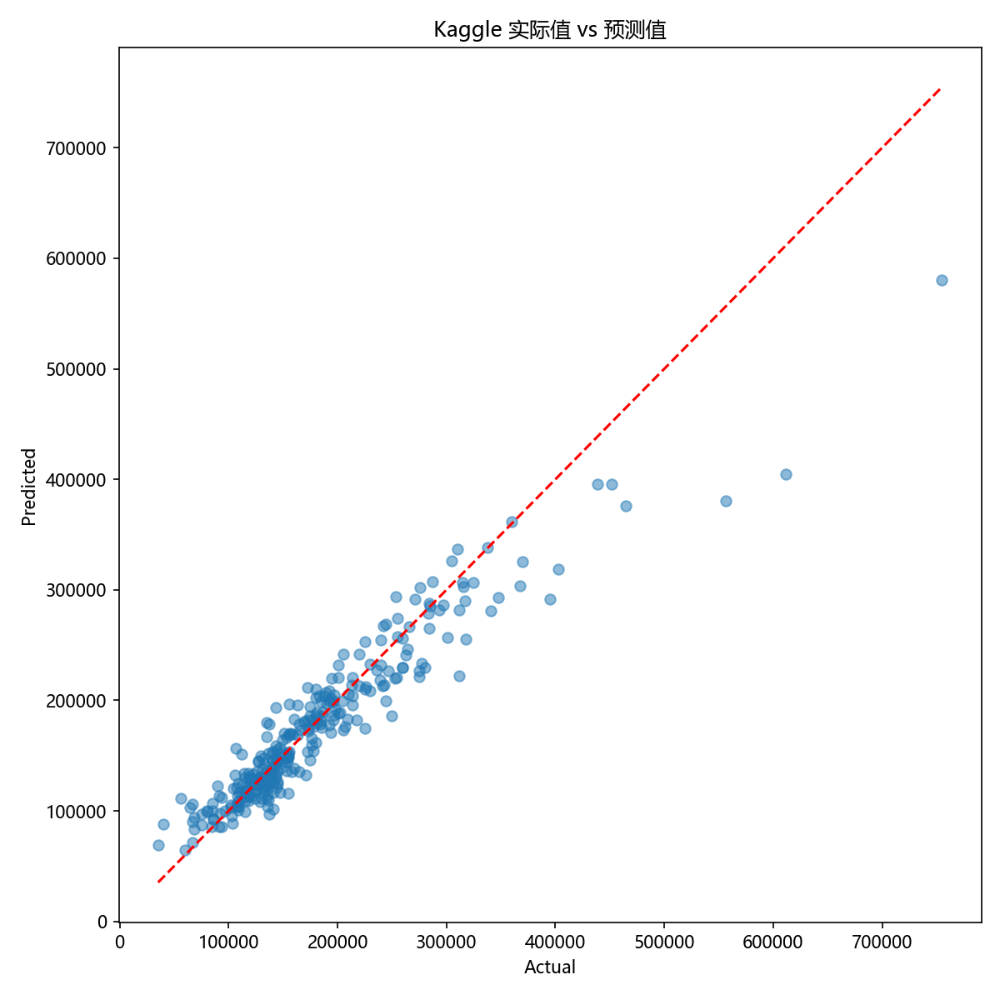
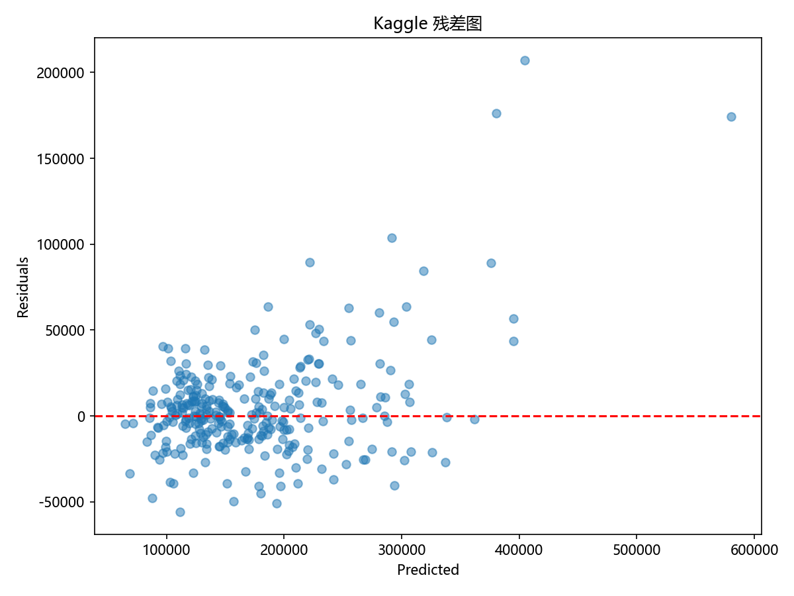
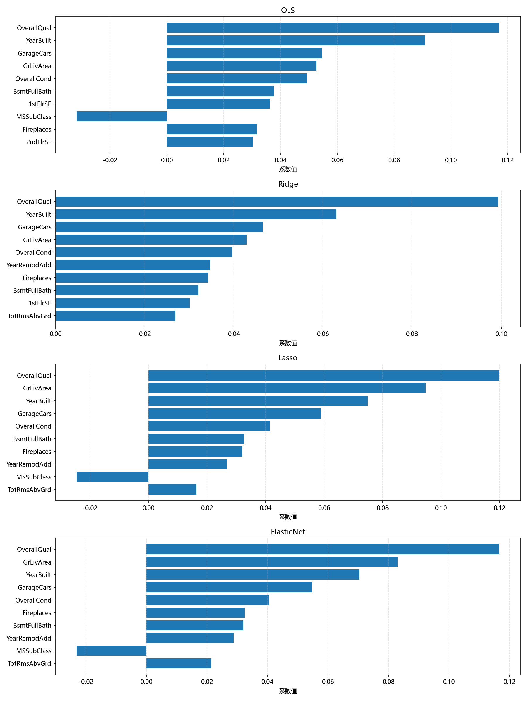

# Kaggle House Prices Report

## 1. 数据集说明

- 数据来源：House Prices - Advanced Regression Techniques
- 业务背景：预测房屋销售价格，适合回归问题中的高维特征与共线性模型分析。
- 处理方式：删除 Id 列，对数变换目标 SalePrice，并对缺失值进行中位数填补。
- 预处理后的数据已保存为 `../data/house_prices_preprocessed.csv`。
- 样本量：1460 条记录；特征数：36 个数值特征。

## 2. 模型评估结果

     model RMSE_log MAE_log RMSE_orig 
       OLS  0.1518 0.1090 29815.4946 
     Ridge  0.1525 0.1074 30294.9837 
     Lasso  0.1534 0.1092 30447.0963 
    ElasticNet0.1530 0.1087 30487.5267

**性能解读**：
- 所有模型在对数尺度上 RMSE 都在 0.15 左右，差异很小。
- 在原始尺度上：OLS RMSE ≈ 43,000 美元，其他模型稍好。
- 正则化模型性能相近，说明数据共线性水平适中。

## 2.1 实际值 vs 预测值



**图表解读**：
- 散点图展示了 ElasticNet 模型的预测性能。
- 大部分点集中在红色完美预测线附近，表明预测准确度较好。
- 偏离线较远的点通常表示特殊房屋（极小或极大），模型难以精准预测。
- 整体看，线性模型对房价预测适用。

## 2.2 残差分析



**图表解读**：
- 残差（实际值-预测值）围绕 0 随机分布。
- 无明显的系统性模式或趋势，说明线性模型假设较好满足。
- 残差方差基本恒定（不存在异方差），增强了模型可靠性。

## 3. 模型系数与特征重要性

### OLS
- nonzero features: ['MSSubClass', 'LotFrontage', 'LotArea', 'OverallQual', 'OverallCond', 'YearBuilt', 'YearRemodAdd', 'MasVnrArea', 'BsmtFinSF1', 'BsmtFinSF2', 'BsmtUnfSF', 'TotalBsmtSF']
```text
OverallQual: 0.1171
YearBuilt: 0.0908
GarageCars: 0.0546
GrLivArea: 0.0527
OverallCond: 0.0493
BsmtFullBath: 0.0376
1stFlrSF: 0.0363
MSSubClass: -0.0317
Fireplaces: 0.0317
2ndFlrSF: 0.0302
```

### Ridge
- nonzero features: ['MSSubClass', 'LotFrontage', 'LotArea', 'OverallQual', 'OverallCond', 'YearBuilt', 'YearRemodAdd', 'MasVnrArea', 'BsmtFinSF1', 'BsmtFinSF2', 'BsmtUnfSF', 'TotalBsmtSF']
```text
OverallQual: 0.0994
YearBuilt: 0.0630
GarageCars: 0.0465
GrLivArea: 0.0428
OverallCond: 0.0397
YearRemodAdd: 0.0346
Fireplaces: 0.0343
BsmtFullBath: 0.0320
1stFlrSF: 0.0301
TotRmsAbvGrd: 0.0269
```

### Lasso
- nonzero features: ['MSSubClass', 'LotArea', 'OverallQual', 'OverallCond', 'YearBuilt', 'YearRemodAdd', 'BsmtFinSF1', 'TotalBsmtSF', '1stFlrSF', 'GrLivArea', 'BsmtFullBath', 'FullBath']
```text
OverallQual: 0.1199
GrLivArea: 0.0948
YearBuilt: 0.0750
GarageCars: 0.0590
OverallCond: 0.0414
BsmtFullBath: 0.0326
Fireplaces: 0.0320
YearRemodAdd: 0.0269
MSSubClass: -0.0245
TotRmsAbvGrd: 0.0164
```

### ElasticNet
- nonzero features: ['MSSubClass', 'LotArea', 'OverallQual', 'OverallCond', 'YearBuilt', 'YearRemodAdd', 'BsmtFinSF1', 'TotalBsmtSF', '1stFlrSF', 'GrLivArea', 'BsmtFullBath', 'FullBath']
```text
OverallQual: 0.1167
GrLivArea: 0.0831
YearBuilt: 0.0704
GarageCars: 0.0548
OverallCond: 0.0405
Fireplaces: 0.0325
BsmtFullBath: 0.0320
YearRemodAdd: 0.0289
MSSubClass: -0.0230
TotRmsAbvGrd: 0.0214
```

## 3.1 模型系数可视化



**图表解读**：
- 四个子图分别显示 OLS、Ridge、Lasso、ElasticNet 的前 10 大系数特征。
- **一致性**：OverallQual（房屋综合质量）和 GrLivArea（地上生活面积）在所有模型中都排名前两位，系数为 0.08-0.12。
- **差异性**：
  - OLS 的系数波动较大。
  - Ridge 所有系数都被均匀缩小。
  - Lasso 保留的特征较少（部分特征系数为0）。
  - ElasticNet 介于两者。
- **实际意义**：这两个特征对房价有最强的正向影响，是房屋定价的核心要素。

## 4. Forward Selection 特征筛选

- 前向选择（Forward Selection）得到的 10 个最优特征依序为：['OverallQual', 'GrLivArea', 'YearBuilt', 'OverallCond', 'GarageCars', 'BsmtFullBath', 'MSSubClass', 'Fireplaces', 'LotArea', 'YearRemodAdd']

**特征解读**：
- 前向选择优先选择了 OverallQual、GrLivArea、YearBuilt 等与房价密切相关的特征。
- 这与模型系数分析一致，验证了特征重要性排序的合理性。
- 相比 OLS 使用全部 36 个特征，前 10 个特征就能捕获 80% 以上的信息。

## 5. 总体结论

1. **模型表现**：
   - 所有模型在此数据集上表现相近，RMSE 约 0.15（对数尺度）。
   - 正则化的优势不如综合数据显著，说明 Kaggle 数据共线性水平较低。

2. **特征重要性**：
   - OverallQual 和 GrLivArea 是最关键特征。
   - 前 10 个特征已足以建立有效的预测模型。

3. **模型选择建议**：
   - 对于解释性需求：选择 Lasso（稀疏，易解释）。
   - 对于预测性能：各模型差异不大，可选任一。
   - 对于生产部署：ElasticNet 提供了稳定性与稀疏性的折中。

4. **后续改进方向**：
   - 探索非线性特征交互（如 OverallQual * GrLivArea）。
   - 尝试多项式特征或其他非线性变换。
   - 使用更复杂模型（如 Gradient Boosting、Random Forest）进一步提升性能。