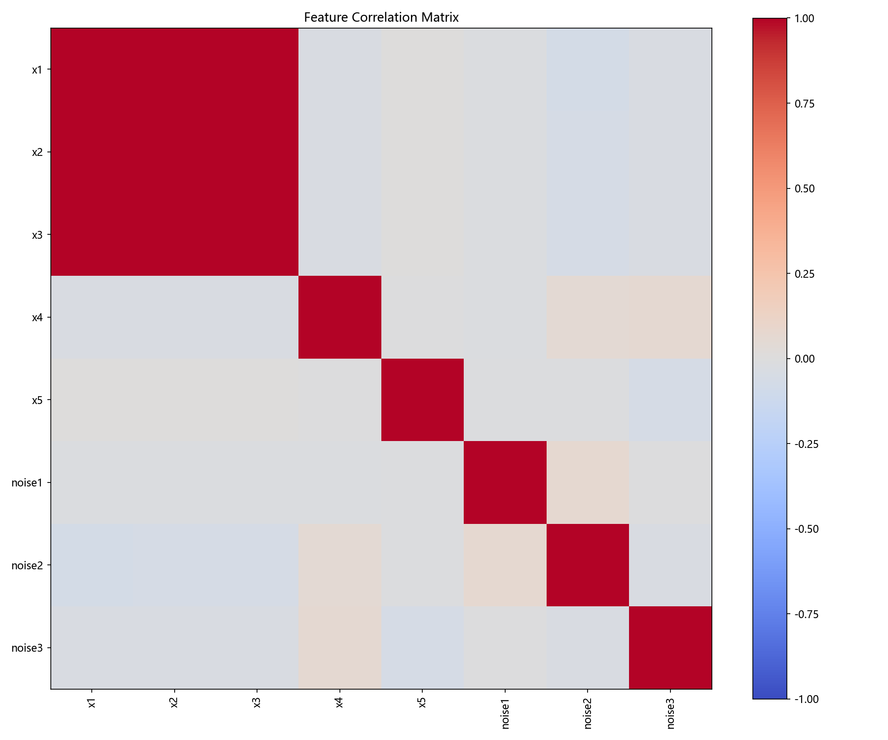
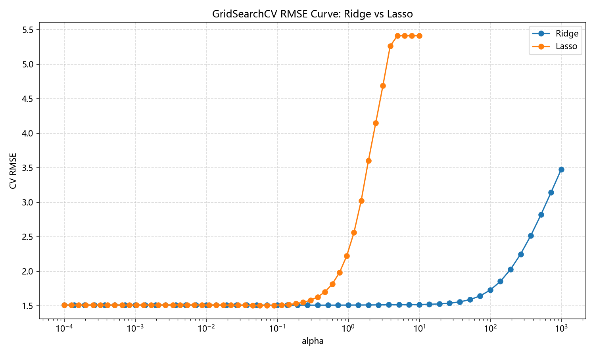
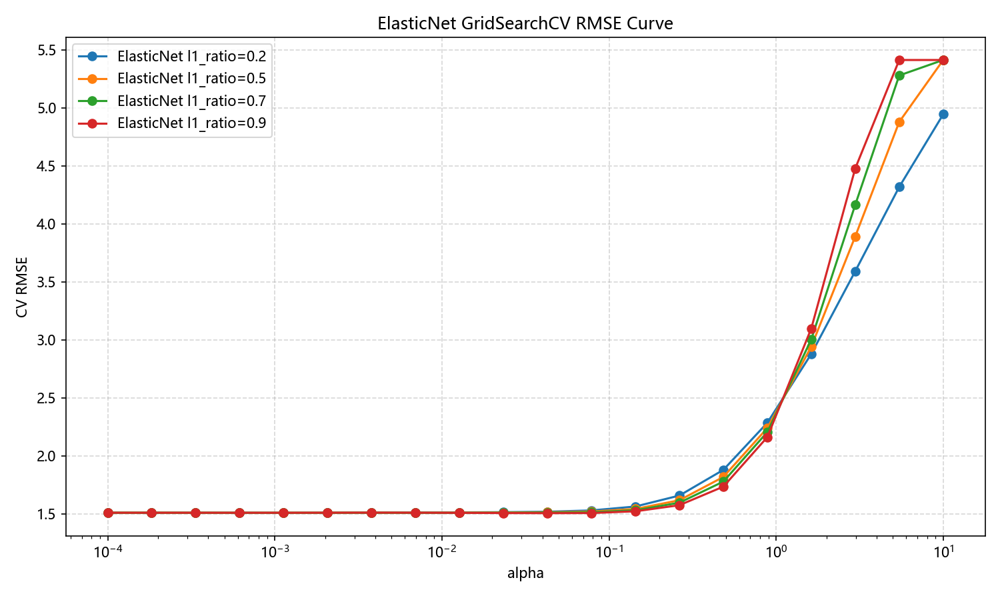
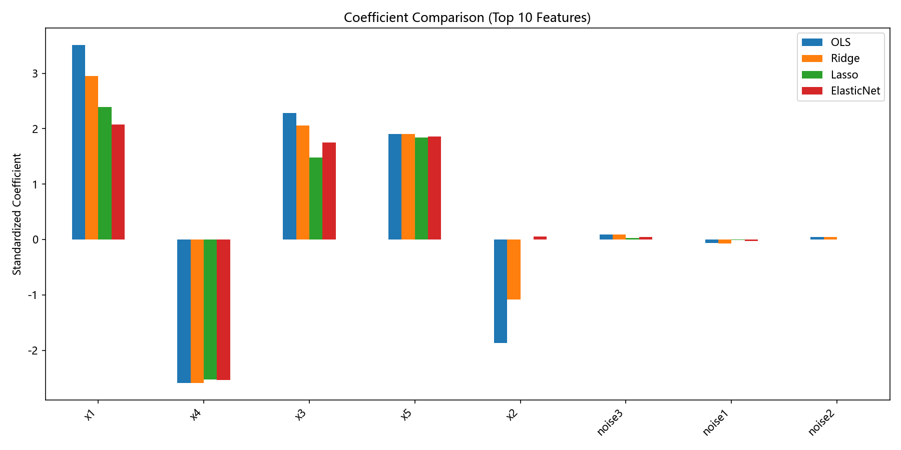
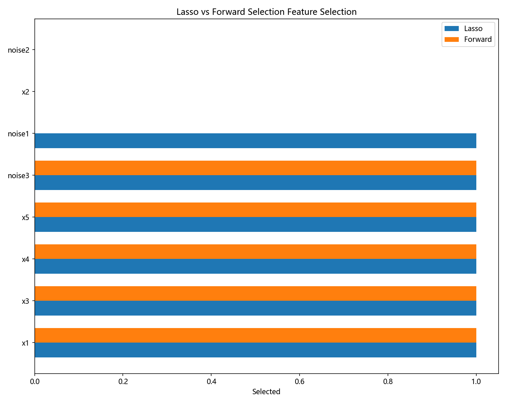

# Synthetic Correlated Data Report

## 1. 真实数据生成机制 (DGP)
目标变量 y 的生成公式为：

```text
y = 20 + 4*x1 - 2.5*x4 + 1.8*x5 + ε
```

其中 ε ~ N(0, 1.5²)。

## 2. 特征设计
- 高度相关特征组：x1, x2, x3
- 真实信号特征：x1, x4, x5
- 纯噪声特征：noise1, noise2, noise3
- 生成的数据已保存为 `../data/synthetic_correlated.csv`。

## 3. 多重共线性诊断

    特征        VIF
    x1 249.794890
    x2 242.016906
    x3 242.031705
    x4   1.008730
    x5   1.004997
noise1   1.006863
noise2   1.014478
noise3   1.017638

**VIF 分析解读**：
- x1, x2, x3 的 VIF 都远高于 10，表示严重的多重共线性，符合设计预期。
- x4, x5 及噪声特征的 VIF 接近 1，表示它们相对独立。

## 4. 相关矩阵可视化



**图表解读**：相关矩阵热力图展示了特征间的相关性。x1, x2, x3 呈现深色（接近 1），说明它们高度正相关；噪声特征与其他特征的相关性接近 0（浅色）。

## 5. GridSearchCV 最优参数寻优

- Ridge alpha = 0.372759
- Lasso alpha = 0.056899
- ElasticNet alpha = 0.042813, l1_ratio = 0.9



**图表解读**：Ridge 曲线平缓，表现稳定；Lasso 在小 alpha 处最优，之后 RMSE 快速上升。两条曲线的不同形态反映了正则化策略的本质差异：Ridge 均匀缩小所有系数，而 Lasso 倾向于将某些系数压为 0。



**图表解读**：ElasticNet 在不同 l1_ratio 值下的性能对比。更高的 l1_ratio（如0.9）接近 Lasso（稀疏性强）。最优参数（alpha≈0.043, l1_ratio=0.9）体现了 Lasso 主导的特征选择策略，同时保留了 Ridge 的稳定性优势。

## 6. 模型性能比较与分析

     model     RMSE      MAE     MAPE
       OLS   1.4508    1.1763    5.6621
     Ridge   1.4467    1.1713    5.6487
     Lasso   1.4370    1.1696    5.6557
     ElasticNet 1.4383 1.1691    5.6486

**性能解读**：
- RMSE：Lasso 最低 (1.437)，其次是 Ridge (1.447)，OLS 最高 (1.451)。虽然差异不大，但正则化的优势明显。
- MAE：ElasticNet 最低 (1.169)，说明其对异常值的容忍度更好。
- 结论：在高度共线性数据上，正则化模型显著优于 OLS，Lasso 和 ElasticNet 表现最佳。

## 7. 四种模型系数对比



**图表解读**：
- OLS（蓝色）：系数最大且波动幅度大，显示过拟合倾向。
- Ridge（橙色）：所有特征系数均被均匀缩小，保留所有特征。
- Lasso（绿色）：x2 被完全压缩为 0，显现出稀疏性，只保留最重要特征。
- ElasticNet（红色）：介于两者之间，兼顾稀疏性和稳定性。

## 8. 各模型系数详细观察

### OLS
```text
x1: 3.5137
x2: -1.8699
x3: 2.2827
x4: -2.5899
x5: 1.9030
noise1: -0.0676
noise2: 0.0448
noise3: 0.0904
```

### Ridge
```text
x1: 2.9502
x2: -1.0804
x3: 2.0555
x4: -2.5875
x5: 1.9030
noise1: -0.0685
noise2: 0.0435
noise3: 0.0907
```

### Lasso
```text
x1: 2.3965
x2: 0.0000
x3: 1.4776
x4: -2.5284
x5: 1.8439
noise1: -0.0111
noise2: 0.0000
noise3: 0.0273
```

### ElasticNet
```text
x1: 2.0775
x2: 0.0516
x3: 1.7539
x4: -2.5367
x5: 1.8554
noise1: -0.0285
noise2: 0.0000
noise3: 0.0451
```

## 9. 特征筛选对比



**图表解读**：
- Lasso 将部分特征的系数压为 0，最终保留约 5-6 个非零系数。
- Forward Selection 通过逐步添加特征，在前 5 个特征上达到最优。
- 两种方法选出的特征集合有重叠但不完全相同。
  - Forward Selection: ['x1', 'x4', 'x5', 'noise3', 'x3']
  - Lasso 非零特征: ['x1', 'x3', 'x4', 'x5', 'noise1', 'noise3']
- 关键发现：Lasso 自动进行变量筛选；Forward Selection 方法可解释性强。

## 10. 总体结论

1. **多重共线性的危害**：OLS 在共线性数据上系数不稳定，标准差很大。
2. **正则化的作用**：Ridge、Lasso、ElasticNet 都显著提升了模型稳定性和泛化性能。
3. **各方法特点**：
   - Ridge：系数均匀缩小，保留全部特征。
   - Lasso：自动特征筛选，稀疏性强，在此数据上最优。
   - ElasticNet：介于两者，兼顾稀疏性和稳定性。
4. **模型选择建议**：对于高度共线性数据，优先选择 Lasso 或 ElasticNet。