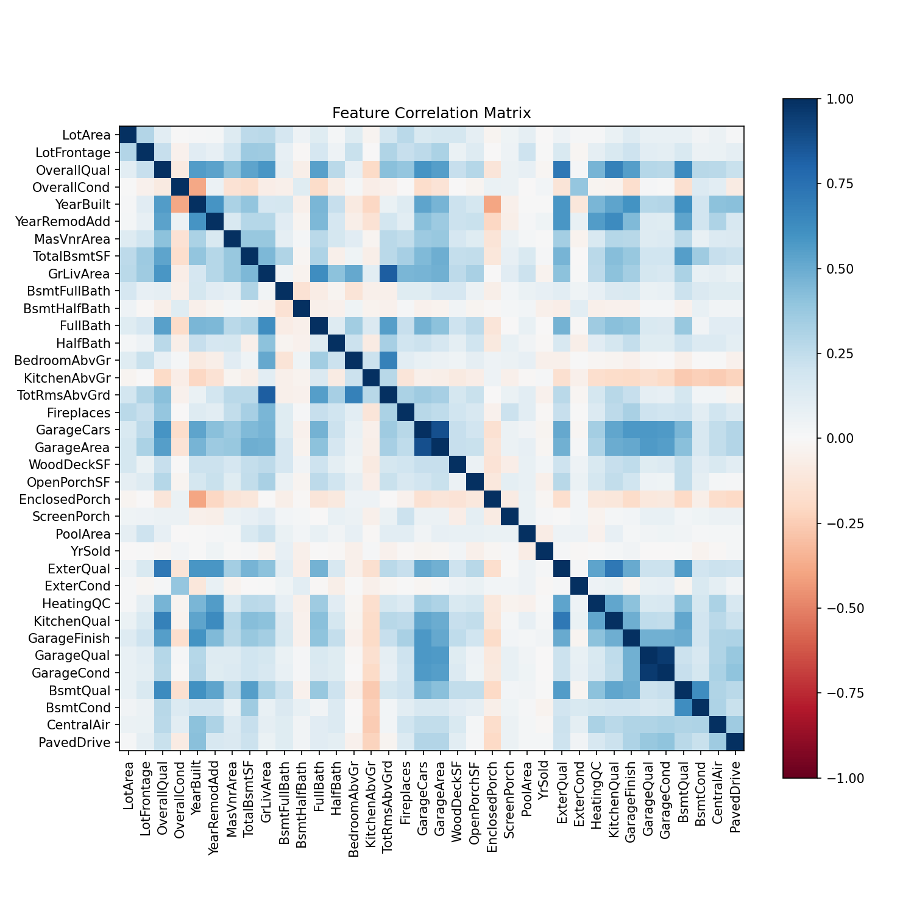
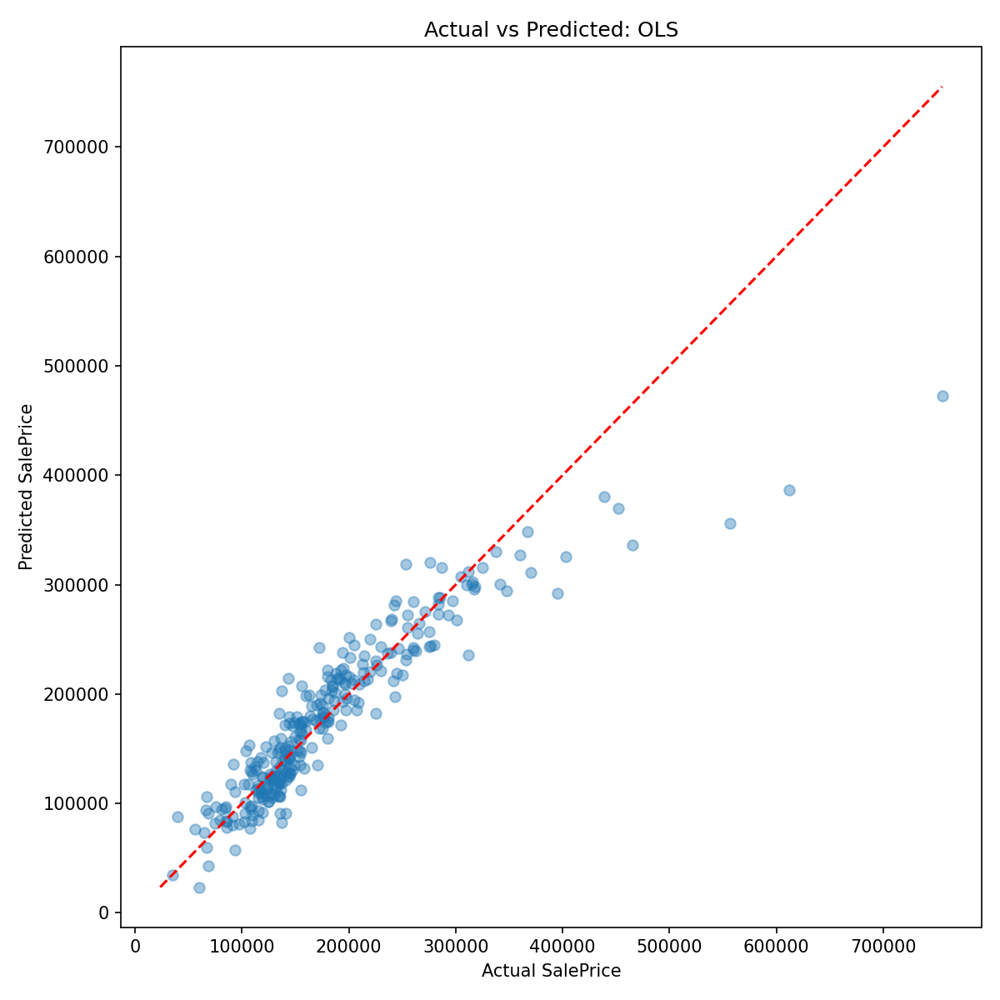
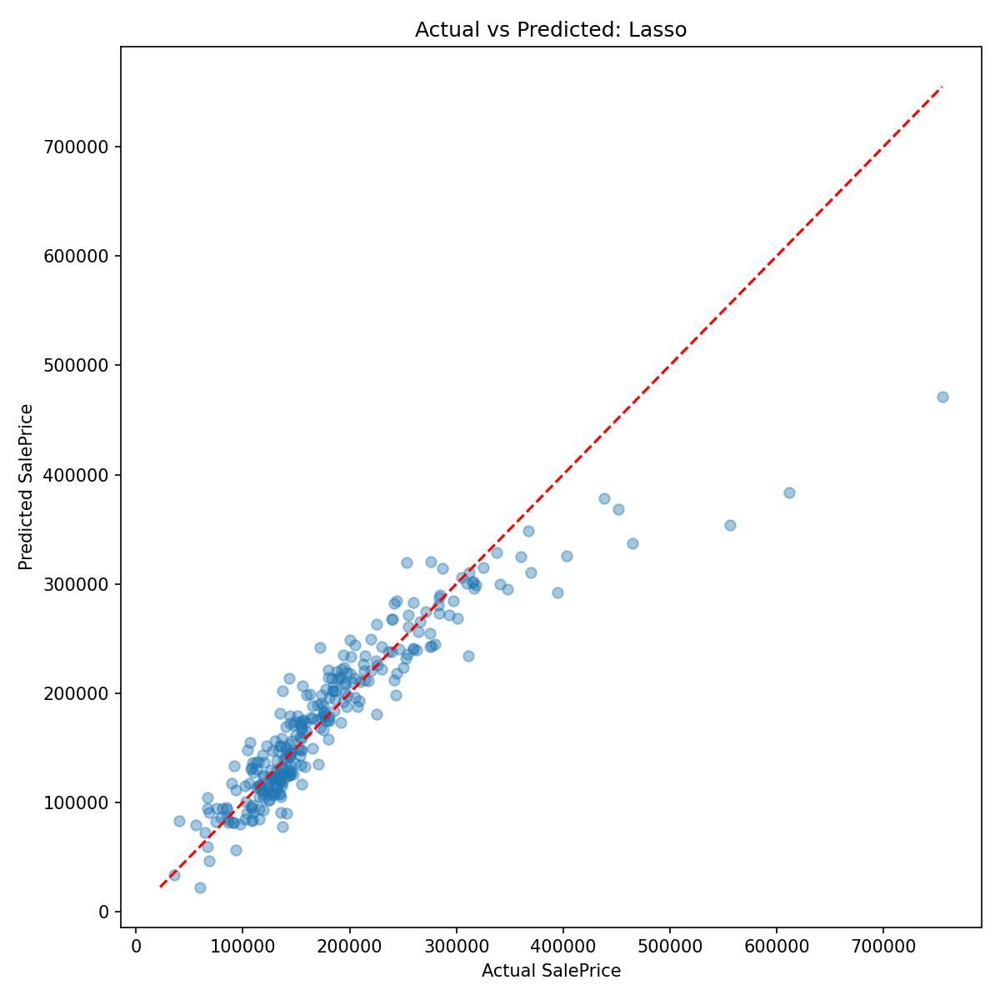
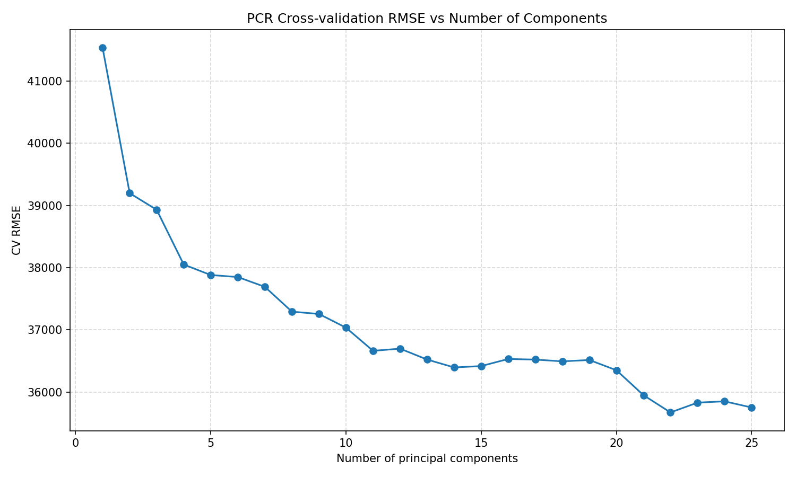
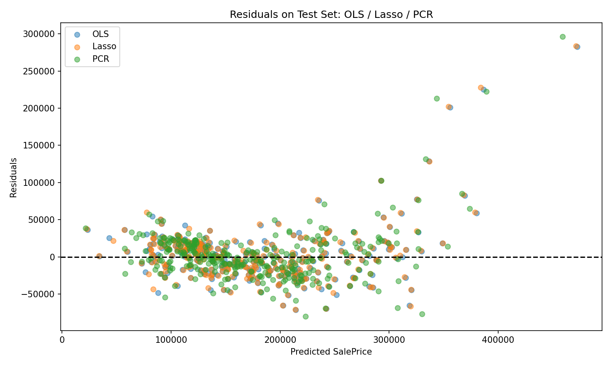

# Task D：Kaggle House Prices 数据分析

## 1 特征相关性分析

图1 特征相关系数矩阵

图中颜色越深表示相关性越强。

可以观察到：

* GarageCars与GarageArea高度相关；
* OverallQual与KitchenQual、ExterQual高度相关；
* 多个面积类指标之间存在明显相关性。

说明数据中存在较强多重共线性。

---

## 2 OLS、Lasso和PCR预测结果比较

图2 OLS预测结果

图3 Lasso预测结果

图4 PCR预测结果

红色虚线表示理想预测：

[
Predicted=Actual
]

大部分样本分布在参考线附近，说明三种模型均具有较好的预测能力。

但对于高价房：

* 实际价格大于40万美元时；
* 大部分预测点位于参考线下方；

说明三种模型均存在一定程度的高价房低估现象。

---

## 3 PCR主成分选择

图5 PCR交叉验证RMSE曲线

随着主成分增加：

* CV误差逐渐下降；
* 在22个主成分附近达到最优；
* 之后下降趋势明显减缓。

因此最终选择22个主成分构建PCR模型。

---

## 4 残差分析

图6 三种模型残差分布

可以观察到：

* 大部分残差围绕0分布；
* 高预测价格区域残差明显增大；
* 出现轻微漏斗形结构。

说明房价越高，预测不确定性越大，存在一定异方差现象。

---

## 5 结论

测试集结果显示：

* OLS RMSE = 35546
* Lasso RMSE = 35540
* PCR RMSE = 36695

Lasso表现最好，OLS非常接近，PCR略逊。

虽然House Prices数据具有明显的潜在因子结构，但PCR并未取得最佳预测性能。这说明降维并不一定带来更高精度，具体效果仍取决于数据特征与模型设定。

因此：

* 如果追求变量解释性，推荐Lasso；
* 如果关注共线性和稳定性，可以考虑PCR；
* 对当前数据集而言，Lasso是综合表现最优的方法。
