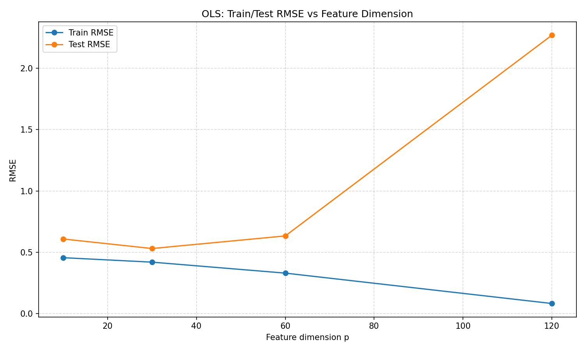
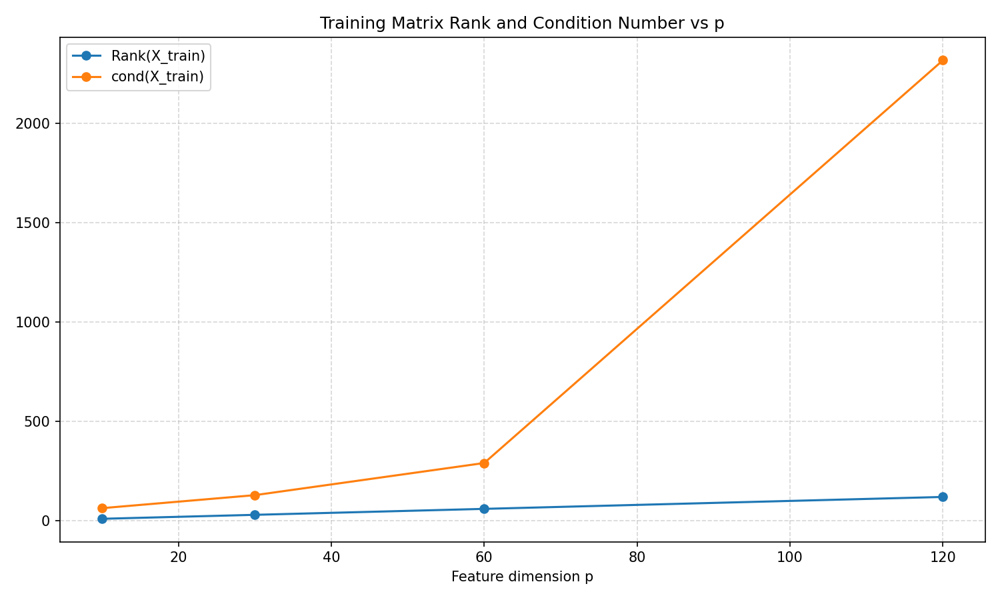
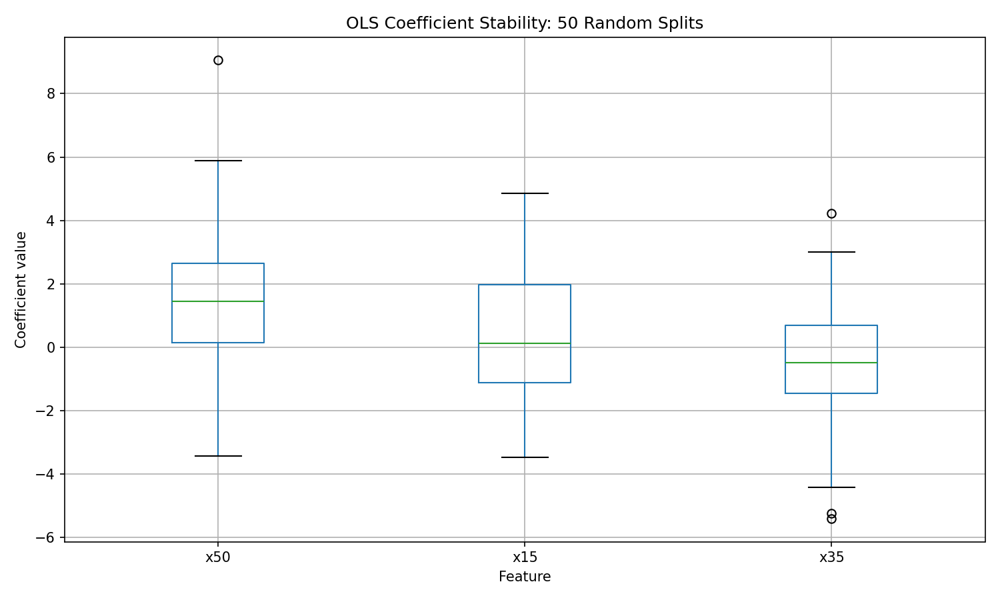
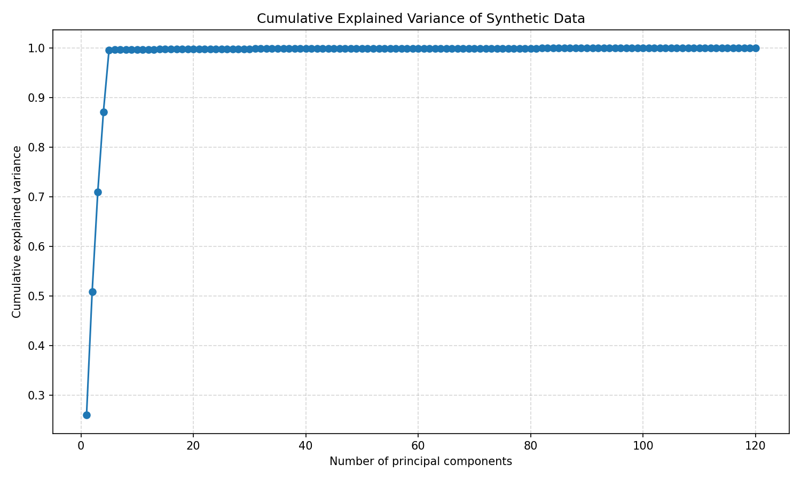
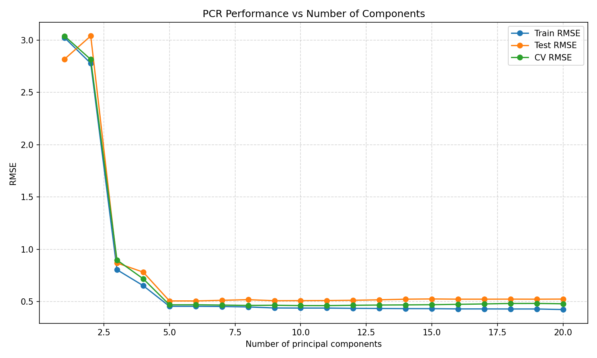

# Week 14 实验报告：高维回归、PCA 与 PCR

## 1 数据生成机制

本实验构造了一组具有潜在低秩结构的高维模拟数据。数据包含160个样本、120个特征，其中所有特征均由5个潜在因子（latent factors）线性组合生成，并叠加少量随机噪声。目标变量 y 同样由这5个潜在因子驱动。

因此，该数据同时具有以下两个特点：

1. 特征维度较高（p=120）；
2. 特征之间存在显著相关性和信息冗余。

这类数据是研究高维回归、多重共线性以及降维方法的典型场景。

---

## 2 Task A：高维问题对 OLS 的影响

### 2.1 不同维度下 OLS 训练误差与测试误差变化

图1 OLS训练集与测试集RMSE随特征维度变化

图1横轴表示特征维度 p，纵轴表示RMSE。其中蓝线表示训练集RMSE，橙线表示测试集RMSE。

从图中可以发现：

* 当特征维度由10增加到120时，训练集RMSE持续下降；
* 测试集RMSE先下降后上升；
* 当 p=120 时，训练误差已经接近于0，但测试误差明显增大。

这一现象表明模型开始过拟合。虽然模型能够很好地拟合训练数据，但对新样本的预测能力反而下降。

因此，在高维环境下，“训练误差很小”并不一定意味着模型性能更好，反而可能是模型过度学习噪声的危险信号。

---

### 2.2 设计矩阵病态程度分析

图2 训练矩阵秩与条件数随特征维度变化

图2中横轴为特征维度 p，蓝线表示训练矩阵秩 Rank(X)，橙线表示条件数 Condition Number。

从图中可以观察到：

* 随着特征维度增加，矩阵秩不断提高；
* 条件数快速增大；
* p=120时条件数达到最高。

说明设计矩阵逐渐趋于病态（ill-conditioned），OLS参数估计的数值稳定性不断下降。

---

### 2.3 OLS系数稳定性分析

图3 OLS系数稳定性箱线图

图3展示了50次随机训练集划分下三个代表性变量系数的分布情况。

可以发现：

* x50、x15和x35均存在较大的波动范围；
* 部分变量的系数分布同时跨越正值和负值区域；
* 个别变量甚至出现明显离群点。

这说明：

同一个变量在不同数据划分下，其估计系数可能发生显著变化，甚至出现符号翻转（sign flip）。

虽然模型整体预测误差变化不大，但参数解释已经变得不可靠。这正是高维共线性环境下OLS的重要风险之一。

---

## 3 Task B：PCA与PCR

### 3.1 PCA累计解释方差分析

图4 PCA累计解释方差曲线

图4横轴表示主成分个数，纵轴表示累计解释方差比例。

从图中可以发现：

* 前3个主成分已经解释约70%以上方差；
* 前5个主成分解释约99%的总体方差；
* 之后曲线趋于平缓。

说明原始120维特征实际上主要由少数潜在因子决定。

这一结果与数据生成机制中的5个latent factors高度一致，验证了数据确实具有明显的低秩结构。

---

### 3.2 PCR模型性能分析

图5 PCR训练误差、测试误差和交叉验证误差

图5横轴为主成分个数k，纵轴为RMSE。

其中：

* Train RMSE表示训练误差；
* Test RMSE表示测试误差；
* CV RMSE表示五折交叉验证误差。

可以发现：

* 当k较小时模型欠拟合；
* 随着k增加，误差快速下降；
* 当k≈5附近时性能趋于稳定；
* 继续增加主成分后收益有限。

由于真实数据由5个潜在因子生成，因此PCR在保留少量主成分时即可恢复主要信息。

---

### 3.3 PCR理论表达

PCR首先利用PCA将原始高维空间投影到低维主成分空间，再利用这些主成分进行回归建模。

---

## 4 实验结论

本实验表明：

1. 高维和共线性会导致OLS出现过拟合和系数不稳定问题；
2. PCA能够识别数据中的低维潜在结构；
3. PCR通过信息压缩提高模型稳定性；
4. 当数据具有明显latent-factor结构时，PCR比直接在原始变量空间建模更加合理。
