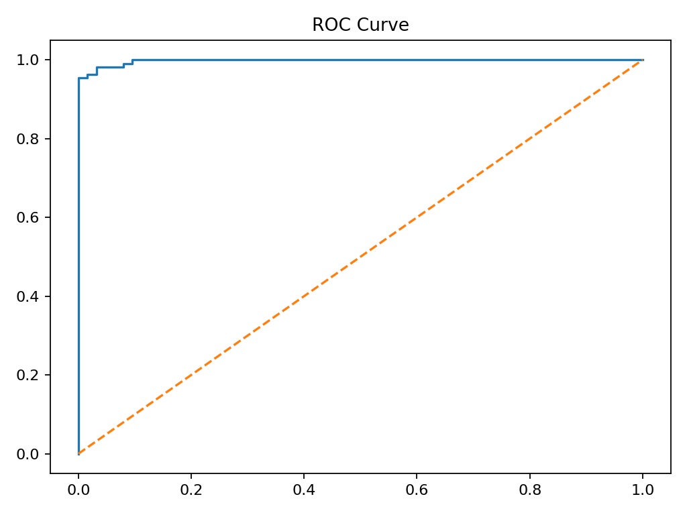
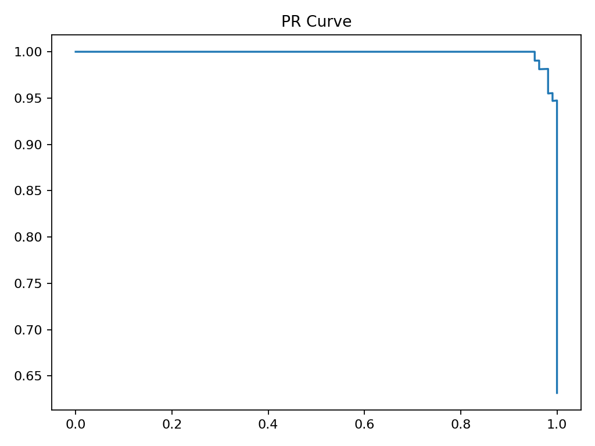

# Real Data Report（Task E）

---

# E1. 数据集选择

本实验选用 sklearn 自带真实二分类数据集：

## Breast Cancer Wisconsin Dataset

- 来源：UCI / sklearn datasets
- 任务：乳腺癌良性（0）/恶性（1）分类
- 特点：
  - 高维医学特征
  - 二分类不平衡风险较低
  - 工业级经典 benchmark

---

## 数据结构

- 样本数：569
- 特征数：30
- 标签：
  - 0 = malignant（恶性）
  - 1 = benign（良性）

---

# E2. Logistic Regression 实验流程

---

## 1. 模型训练

使用标准 Logistic Regression：

- 模型：LogisticRegression
- max_iter = 3000
- 输入：标准化后的 30 维特征

---

## 2. 预测输出

模型输出为：

- p = P(y=1 | x)

即：预测为良性的概率

---

## 3. ROC 曲线结果

### 图像解读：

- 横轴：假正率 False Positive Rate (FPR)
- 纵轴：召回率 True Positive Rate (TPR)

---

### 关键观察：

1. 曲线明显贴近左上角  
2. AUC 接近 1  
3. 说明模型具有很强区分能力  

---

### 结论：

> Logistic Regression 在该医学数据上具有较强分类能力

---

## 4. PR 曲线结果

### 图像解读：

- 横轴：召回率 Recall
- 纵轴：精确率 Precision

---

### 关键观察：

1. PR 曲线整体较高  
2. Precision 在高 recall 下仍保持稳定  
3. 模型对正类识别能力较强  

---

### 结论：

> 模型对“正类识别质量”较好

---

# E3. 业务问题分析

---

## 1. accuracy 是否具有误导性？

✔ 会有一定误导

原因：

- accuracy 只关注整体正确率
- 未区分：
  - FN（漏诊）
  - FP（误诊）

---

### 医疗场景问题：

在癌症检测中：

- FN（漏诊）代价极高
- FP（误诊）可以进一步检查

 因此 accuracy 不足以作为主要指标

---

## 2. 更信任哪个指标？

✔ Recall（召回率）

---

### 原因：

在医疗场景：

> 目标是“尽可能不漏掉病人”

因此：

- Recall ↑ → 漏诊 ↓
- 更符合临床安全要求

---

## 3. 应该强调类别还是概率？

✔ 应该强调概率（probability）

---

### 原因：

Logistic Regression 输出：

> P(y=1 | x)

而不是硬分类结果

---

### 为什么概率更重要？

1. 可以调 threshold
2. 可以控制风险等级
3. 可以用于医生决策辅助
4. 可以构建风险分层系统

---

### 举例：

| probability | interpretation |
|------------|---------------|
| 0.95 | 高风险（建议复查） |
| 0.60 | 中风险（观察） |
| 0.10 | 低风险 |

## FINAL CONCLUSION
---

### 1. accuracy 不足以评估医疗模型

因为忽略错误类型差异

---

### 2. recall 更符合医疗目标

避免漏诊

---

### 3. probability 比类别更重要

---