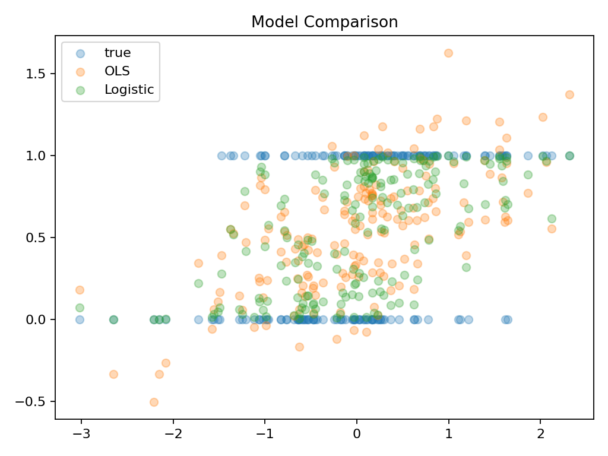

# Synthetic Report

---

# 1. 数据生成机制（DGP）

本实验采用 Logistic 概率生成模型构造二分类数据，其本质是一个典型的广义线性模型（GLM）数据生成过程：

---

## 1.1 数据生成流程

X ~ N(0,1)

η = Xβ  
p = sigmoid(η)  
y ~ Bernoulli(p)

---

## 1.2 机制解释

该过程包含三步：

1. **线性结构（signal）**
   - η = Xβ 用于构造潜在分类信号

2. **非线性映射（probability link）**
   - sigmoid 将线性结果映射到概率空间 (0,1)

3. **随机采样（observation）**
   - y 由 Bernoulli(p) 生成，引入随机性

---

## 1.3 数据本质总结

该数据属于：

- ✔ 概率生成模型（Probabilistic DGP）
- ✔ GLM（广义线性模型）结构
- ✔ 随机分类问题

而不是确定性规则分类。

---

# 2. OLS vs Logistic Regression

---

## 2.1 模型差异

### Linear Regression（OLS）

- 输出：连续实数
- 目标函数：MSE
- 无概率约束
- 无概率解释能力

---

### Logistic Regression

- 输出：概率 p ∈ (0,1)
- 目标函数：Log Loss（Bernoulli MLE）
- 有明确概率语义

---

## 2.2 图像解读

- 蓝色点：真实标签（0/1）
- 橙色点：OLS 预测值
- 绿色点：Logistic 概率输出

---

## 2.3 关键观察

1. OLS 输出范围不受限制，可能出现 <0 或 >1  
2. Logistic 输出始终位于 (0,1)  
3. Logistic 更符合分类问题的概率结构  

---

## 2.4 核心结论

OLS 在该任务中失败的原因是：

> 它在拟合“数值空间”，而不是“概率空间”

---

# 3. 分类结果（Threshold = 0.30）

该阈值由 F1-score 最大化得到。

---

## 3.1 混淆矩阵

| TP | TN | FP | FN |
|----|----|----|----|
| 92 | 55 | 28 | 5 |

---

## 3.2 分类指标

| Metric | Value |
|--------|------|
| Accuracy | 0.8167 |
| Precision | 0.7667 |
| Recall | 0.9485 |
| F1-score | 0.8479 |

---

## 3.3 结果解释

- Recall 很高 → 几乎不漏判正类  
- Precision 中等 → 存在一定误报  
- F1 最优 → precision / recall 达到平衡  

---

## 3.4 为什么 F1 最优？

因为本任务存在：

- 类别不完全均衡
- FN 代价较高（漏判正类）
- 需要 precision 与 recall 权衡

---

# 4. 核心问题回答（A5）

---

## 4.1 LinearRegression 最不自然的地方是什么？

LinearRegression 在本任务中的核心问题是：

> 它将概率分类问题错误建模为连续数值回归问题。

主要体现在：

### （1）输出不合法

- Logistic：p ∈ (0,1)
- OLS：y ∈ (-∞, +∞)

→ 无法保证概率意义

---

### （2）模型假设错配

真实 DGP：

Y ~ Bernoulli(p)

OLS 假设：

Y = Xβ + ε,  ε ~ N(0, σ²)

→ 属于典型 model misspecification

---

### （3）优化目标不匹配

| 模型 | Loss |
|------|------|
| OLS | MSE |
| Logistic | Log Loss |

→ MSE 不适用于概率建模

---

## 4.2 为什么 Logistic Regression 更容易解释为概率？

Logistic Regression 具有三重概率基础：

---

### （1）数学约束

p = sigmoid(η)

→ 保证 p ∈ (0,1)

---

### （2）统计假设一致

Y ~ Bernoulli(p)

→ p 是真实概率参数

---

### （3）MLE 推导一致

通过最大化 likelihood：

log L = y log p + (1-y) log(1-p)

→ 得到 log loss

---

## 4.3 核心区别是什么？

不是：

❌ 能不能分类

而是：

✔ 输出是否具有概率语义

---

## 4.4 最终结论

| 模型 | 本质 | 输出含义 |
|------|------|----------|
| OLS | 数值拟合 | 无概率意义 |
| Logistic | 概率建模 | 概率 |

---

分类问题本质是：

> 概率估计问题，而不是标签预测问题

---
