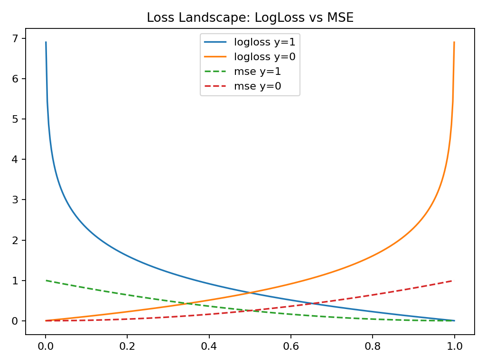
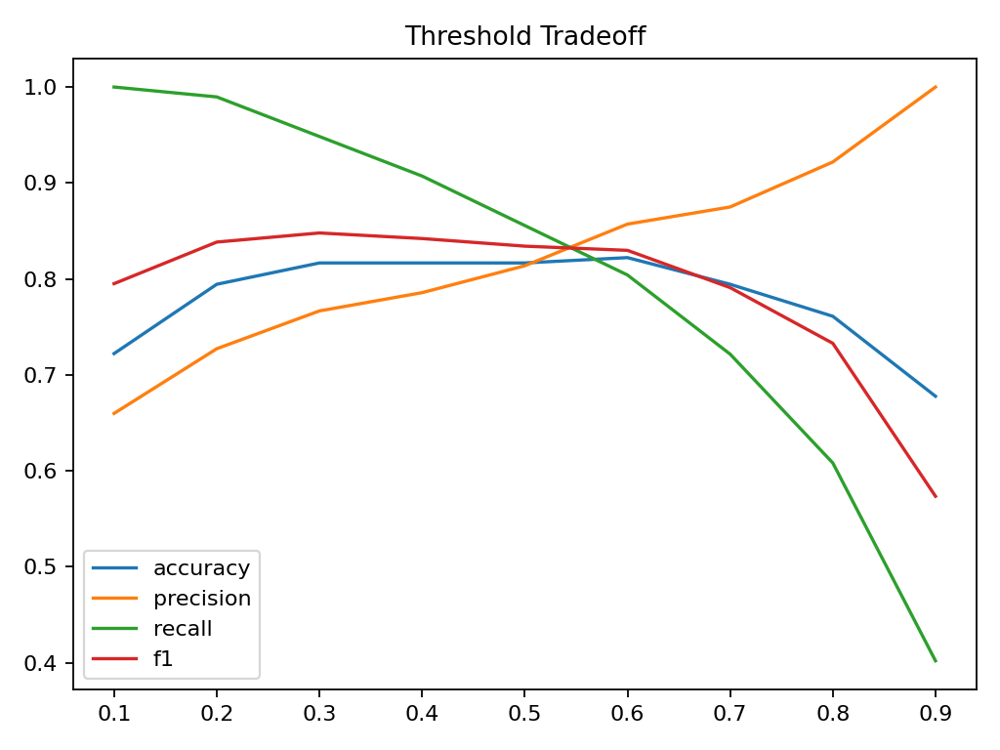

# Task B：从 Bernoulli 概率走到 Log Loss

本部分对应课堂第三幕：从概率建模到 log loss 的统计推导。

---

## B1. Bernoulli → Likelihood → Log Loss

---

### （1）Bernoulli 分布

$$
Y \sim Bernoulli(p)
$$

#### 解释：

Bernoulli 分布用于描述二分类变量：

- 当 y = 1 时，概率为 p
- 当 y = 0 时，概率为 1 - p

因此：

> 二分类问题本质是概率建模问题，而不是确定性分类问题。

---

### （2）单样本 likelihood

$$
L(p;y)=p^y(1-p)^{1-y}
$$

#### 解释：

该表达式统一表示两种情况：

- y = 1 → L = p
- y = 0 → L = 1 - p

它衡量：

> 在给定预测概率 p 的情况下，真实标签 y 出现的可能性。

---

### （3）Log Loss（负对数似然）

$$
-\log L = -[y\log p + (1-y)\log(1-p)]
$$

#### 解释：

该式来源于：

- 对 likelihood 取 log（乘积 → 加和）
- 再取负号变为最小化问题

因此：

> log loss = Bernoulli 分布下的最大似然估计（MLE）目标函数

---

## B2. Loss 曲线分析（图像解释）

---

### 图像说明

- 横轴：预测概率 p ∈ (0,1)
- 纵轴：loss value

比较两类 loss：

- Log Loss（概率模型）
- MSE（回归型误差）

---

### （1）当 y = 1

- p → 1：loss → 0（预测正确）
- p → 0：log loss → ∞（严重惩罚）

 log loss 对“错误且自信预测”惩罚极强

---

### （2）当 y = 0

- p → 0：loss → 0
- p → 1：log loss → ∞

 同样体现对高置信错误的惩罚机制

---

### （3）关键对比

| 情况 | Log Loss | MSE |
|------|----------|-----|
| 轻微错误 | 小惩罚 | 小惩罚 |
| 高置信错误 | 极大惩罚 | 中等惩罚 |

---

### 图像结论

> Log Loss 在极端错误情况下增长速度远高于 MSE

---

## B3. 统计建模对应关系

---

### 1. 为什么“错得很自信”要被重罚？

因为模型输出 p 表示：

> 对正类的“置信概率”

当：

- p → 0.99 但 y = 0

意味着：

> 模型非常确信但完全错误

---

 统计意义：

这种情况说明模型严重偏离真实分布，因此必须强惩罚。

---

### 2. 为什么 log loss 来自 Bernoulli likelihood？

从生成过程：

$$
Y \sim Bernoulli(p)
$$

得到 likelihood：

$$
L(p;y)=p^y(1-p)^{1-y}
$$

取对数：

$$
\log L = y\log p + (1-y)\log(1-p)
$$

再取负号：

$$
-\log L
$$

---

 结论：

> log loss 不是人为设计，而是 Bernoulli + MLE 的直接结果

---

### 3. 为什么 log loss 比 MSE 更自然？

---

#### （1）建模假设不同

| 方法 | 假设 |
|------|------|
| Log Loss | Bernoulli 分布 |
| MSE | Gaussian 分布 |

---

#### （2）任务匹配性

- Log Loss：概率建模
- MSE：数值回归

---

#### （3）行为差异

- Log Loss：区分“轻微错误 vs 极端错误”
- MSE：对错误不敏感

---

### 最终结论

> 当输出被解释为概率时，log loss 是唯一与统计假设一致的损失函数。

---

# Task C：分类指标与 Threshold 分析

---

## C1. 混淆矩阵 + 指标

| TP | TN | FP | FN |
|----|----|----|----|
| 92 | 55 | 28 | 5 |

---

## 分类指标

| Metric | Value |
|--------|------|
| Accuracy | 0.8167 |
| Precision | 0.7667 |
| Recall | 0.9485 |
| F1-score | 0.8479 |

---

### 解释：

- Recall 高：几乎所有正类都被识别
- Precision 中等：存在一定误报
- Accuracy 不稳定（类别不平衡影响）

---

## C2. Threshold 扫描结果

对模型输出概率进行 threshold 扫描：

threshold ∈ [0.1, 0.2, 0.3, ..., 0.9]

---

### 分类指标随 threshold 变化如下：

| threshold | accuracy | precision | recall | f1 |
|----------|----------|-----------|--------|----|
| 0.1 | 0.7222 | 0.6599 | 1.0000 | 0.7951 |
| 0.2 | 0.7944 | 0.7273 | 0.9897 | 0.8384 |
| 0.3 | 0.8167 | 0.7667 | 0.9485 | 0.8479 |
| 0.4 | 0.8167 | 0.7857 | 0.9072 | 0.8421 |
| 0.5 | 0.8167 | 0.8137 | 0.8557 | 0.8342 |
| 0.6 | 0.8222 | 0.8571 | 0.8041 | 0.8298 |
| 0.7 | 0.7944 | 0.8750 | 0.7216 | 0.7910 |
| 0.8 | 0.7611 | 0.9219 | 0.6082 | 0.7329 |
| 0.9 | 0.6778 | 1.0000 | 0.4021 | 0.5735 |

---

### 结论分析：

#### 1. threshold ↑ 时：
- precision ↑（更保守）
- recall ↓（漏检增加）

#### 2. threshold ↓ 时：
- recall ↑（几乎全抓）
- precision ↓（误报增加）

---

### 3. F1 行为：

F1 在 threshold = 0.3 左右达到最大值：

> 表明 precision 与 recall 在该点达到最优平衡

---

## C3. Threshold 曲线解释

---

### 图像解读

- 横轴：threshold
- 纵轴：metric value

---

### 变化规律

#### threshold ↑

- precision ↑（更严格）
- recall ↓（漏检增加）

#### threshold ↓

- recall ↑（尽量全抓）
- precision ↓（误报增加）

---

### F1 曲线意义

F1 在中间达到峰值：

> precision 和 recall 存在天然 trade-off

---

## C4. 业务场景分析（疾病初筛）

---

### 1. 最重要指标

 Recall

---

### 2. 原因

在医疗场景中：

- FN（漏诊）代价极高
- FP（误诊）可以复查

---

### 3. 阈值选择

推荐：

 0.2 ~ 0.3

---

### 4. 理由

该区间：

- recall 接近最大
- precision 可接受
- 更符合“安全优先原则”

---

## 核心结论

### 1. Log Loss

来自 Bernoulli + MLE 推导

---

### 2. MSE vs Log Loss

Log Loss 更符合概率建模逻辑

---

### 3. Threshold

本质是 precision-recall trade-off 控制参数

---
