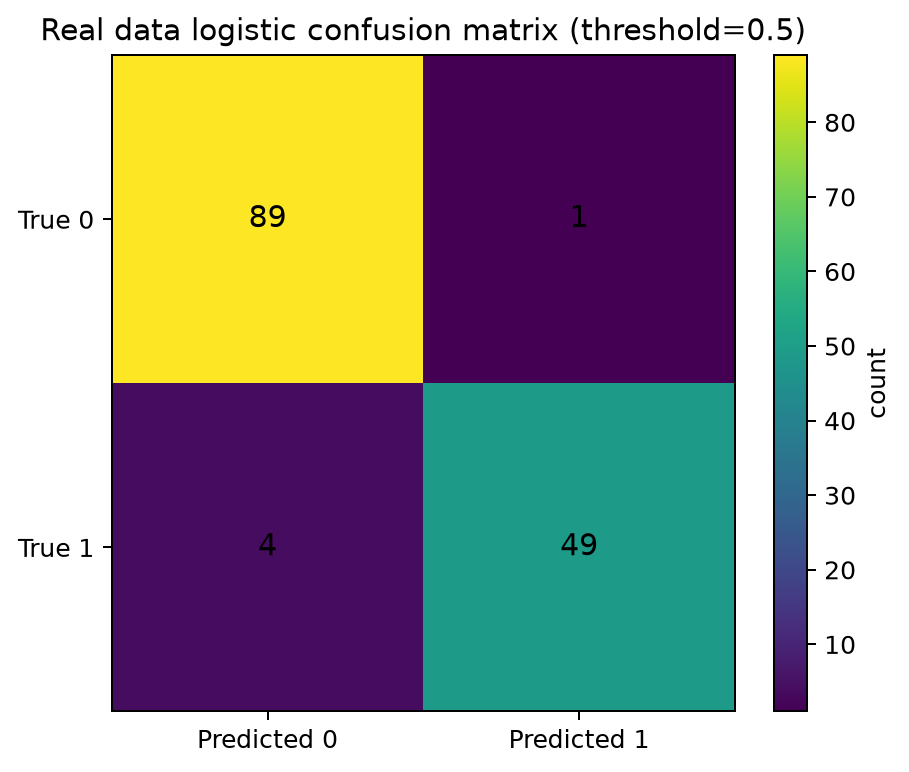
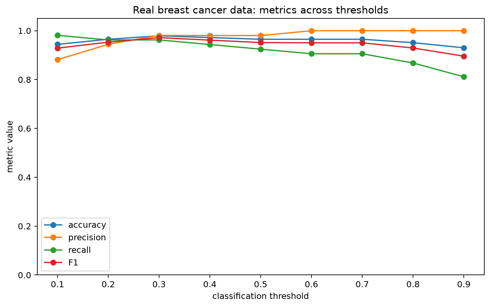

# Week15 真实二分类数据报告：乳腺癌筛查

## 1. 数据说明

真实数据保存在：

```text
week15/data/real_binary_breast_cancer.csv
```

这份数据来自 sklearn 自带的 breast cancer 数据集，共 **569** 行、**30** 个数值特征。原始数据的目标变量区分 malignant 和 benign。本作业把 `is_malignant=1` 设为正类，即“恶性肿瘤”，更符合疾病初筛场景。

正类比例为 **0.373**。这说明它不是完全平衡的数据；如果只看 accuracy，可能会忽略漏诊风险。

## 2. 模型结果

| 模型 | accuracy | precision | recall | F1 | ROC-AUC | log loss | 非零系数数 | best C |
|---|---:|---:|---:|---:|---:|---:|---:|---:|
| 真实数据 L2 Logistic | 0.9650 | 0.9800 | 0.9245 | 0.9515 | 0.9962 | 0.0769 |  |  |
| 真实数据 L1 Logistic | 0.9720 | 0.9804 | 0.9434 | 0.9615 | 0.9969 | 0.0730 | 15 | 1 |
| 真实数据 L2 Logistic | 0.9650 | 0.9800 | 0.9245 | 0.9515 | 0.9962 | 0.0769 | 30 | 1 |



这张图展示默认阈值 0.5 下的混淆矩阵。横轴是预测类别，纵轴是真实类别。对于疾病初筛，最需要关注的是 FN，也就是真实恶性但模型预测为非恶性的样本。

## 3. 真实数据 threshold 分析



这张图横轴是 classification threshold，纵轴是metric value。四条曲线分别表示 accuracy、precision、recall 和 F1。阈值降低时，模型更容易预测为恶性，因此 recall 往往提高；阈值升高时，模型更保守，precision 可能提高，但 recall 可能下降。

在疾病初筛里，我更信任 recall，因为漏诊的成本通常高于误报。若业务方要求尽可能减少漏诊，可以选择 recall 较高的阈值，例如本次扫描中 recall 最高的阈值是 **0.1**。

## 4. 回答真实业务问题

**1）单看 accuracy 会不会误导判断？**

会。疾病筛查中，如果模型 accuracy 很高，但漏掉恶性样本，业务风险仍然很大。因此 accuracy 不能单独作为最终指标。

**2）最后更信任哪个指标？为什么？**

我更重视 recall，同时参考 precision 和 F1。recall 直接反映模型能找回多少真正恶性样本，更贴近初筛场景的安全目标。

**3）向业务方解释模型输出时，强调类别还是概率？**

我会强调概率。类别是由阈值切出来的结果，阈值可以根据业务成本调整；概率能告诉业务方风险程度，更适合排序、复查资源分配和人工审核。
