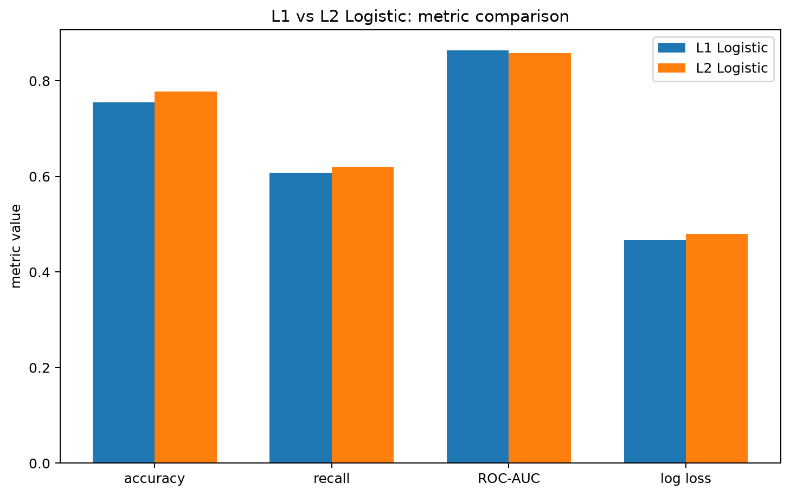
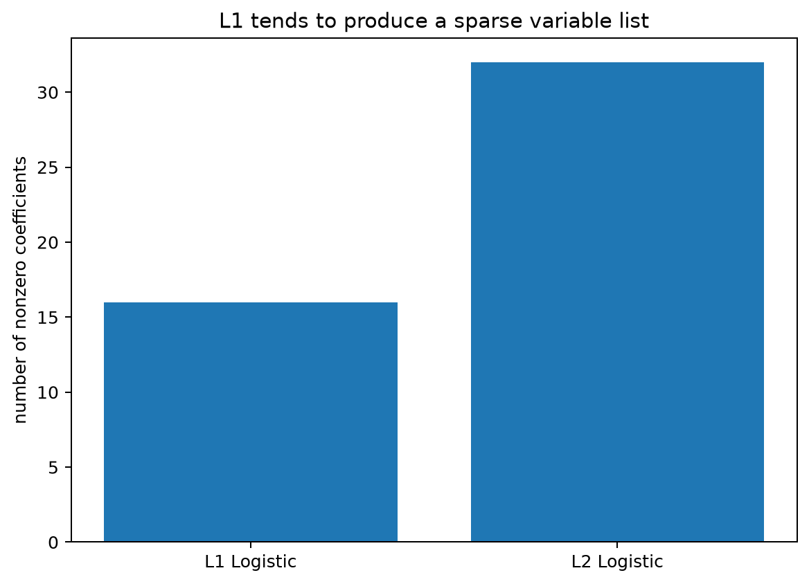
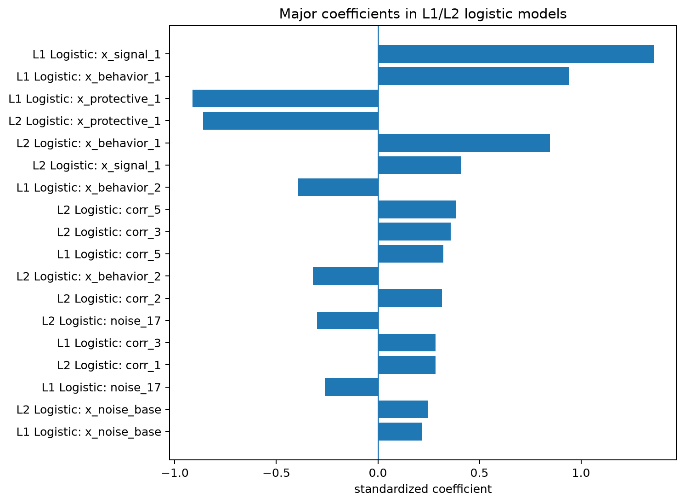

# Week15 正则化逻辑回归报告：L1 vs L2

## 1. 实验设计

本任务对应 Task D。模拟数据中共有 32 个特征，满足“特征数不少于 20”的要求。其中 `x_signal_1`、`x_signal_2` 和 `corr_1` 到 `corr_6` 构成明显相关变量组，另外还加入了多个噪声变量。

所有模型都先使用自定义 `CustomStandardScaler` 在训练集上拟合标准化参数，然后在测试集上 transform，避免数据泄露。`L1` 和 `L2` 逻辑回归都通过 5 折交叉验证选择超参数 `C`，评分标准为负 log loss。

## 2. 测试集表现与模型复杂度

| 模型 | accuracy | precision | recall | F1 | ROC-AUC | log loss | 非零系数数 | best C |
|---|---:|---:|---:|---:|---:|---:|---:|---:|
| L1 Logistic | 0.7556 | 0.7869 | 0.6076 | 0.6857 | 0.8635 | 0.4678 | 16 | 0.2154 |
| L2 Logistic | 0.7778 | 0.8305 | 0.6203 | 0.7101 | 0.8585 | 0.4796 | 32 | 0.1 |

这张图的横轴是分类指标，纵轴是metric value；不同柱子代表 L1 和 L2 逻辑回归。它展示两类正则化模型在 accuracy、recall、ROC-AUC 和 log loss 上的差异。

这张图的横轴是模型，纵轴是number of nonzero coefficients。L1 正则化会把部分系数压成 0，因此更容易得到稀疏模型；L2 正则化会缩小系数，但通常保留大多数变量。

这张图展示绝对值较大的标准化系数。横轴是系数大小，纵轴是模型和变量名。它帮助我们观察 L1/L2 对重要变量的保留方式。

## 3. L1 模型保留的前 10 个主要变量

| feature | coefficient |
|---|---|
| x_signal_1 | 1.3588 |
| x_behavior_1 | 0.9416 |
| x_protective_1 | -0.9134 |
| x_behavior_2 | -0.3928 |
| corr_5 | 0.3225 |
| corr_3 | 0.2844 |
| noise_17 | -0.2600 |
| x_noise_base | 0.2183 |
| noise_13 | -0.1179 |
| corr_2 | 0.0936 |

## 4. 核心问题回答

**1）L1 和 L2 的预测表现差很多吗？**

本次实验中二者预测表现通常不会差很多，主要差异体现在模型复杂度和解释方式上。L2 更倾向于稳定利用全部变量，L1 更倾向于压缩出更短变量名单。

**2）哪一个模型更稀疏？**

本次结果中更稀疏的是 **L1 Logistic**。从number of nonzero coefficients图可以看出，L1 的非零系数数量通常少于 L2。

**3）哪一个更适合给出更短变量名单？**

如果业务方希望得到一个更短、更容易解释的变量名单，我更倾向于 L1。它能直接把一部分变量系数压为 0，因此天然具有变量选择作用。

**4）如果业务方更在意模型稳定性而不是变量筛选，更偏向哪一个？**

如果业务方更在意稳定概率输出，我更偏向 L2。原因是 L2 不会在相关变量之间过于激进地只保留某一个变量，而是把相关变量的系数整体压小，因此在高共线性数据中往往更稳定。
