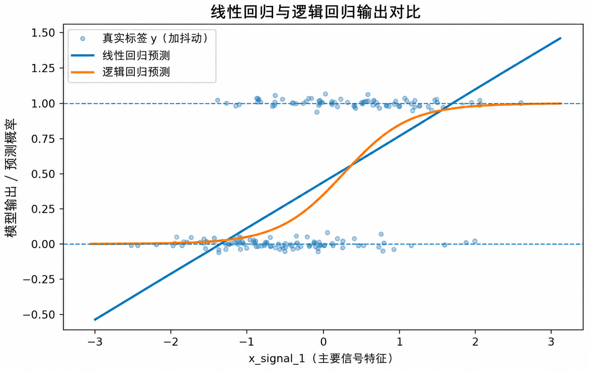

# Week15 模拟二分类报告：LinearRegression vs LogisticRegression

## 1. 数据生成机制（DGP）

本报告对应 Task A。模拟数据保存在：

```text
week15/data/synthetic_binary.csv
```

样本量为 **720**，特征数为 **32**，目标变量为 `y`。`y` 不是通过硬阈值手写出来的，而是先生成真实概率 `true_probability`，再从 Bernoulli 分布中抽样得到。

真实线性得分为：

```text
eta = -0.25
      + 1.60 * x_signal_1
      - 1.25 * x_protective_1
      + 1.10 * x_behavior_1
      - 0.80 * x_behavior_2
      + 0.65 * x_signal_2
      + 0.35 * x_noise_base
```

然后通过 sigmoid 转成概率：

$$
p = \frac{1}{1 + e^{-\eta}}
$$

最后生成：

$$
Y \sim Bernoulli(p)
$$

其中 `x_signal_1`、`x_behavior_1`、`x_signal_2`、`x_noise_base` 会提高正类概率；`x_protective_1` 和 `x_behavior_2` 会降低正类概率。模拟数据正类比例为 **0.442**。此外，`x_signal_1` 与 `x_signal_2` 的相关系数为 **0.861**，后面的 `corr_*` 变量也构成一组相关特征，用于正则化实验。

## 2. LinearRegression 与 LogisticRegression 对比

| 模型 | accuracy | precision | recall | F1 | ROC-AUC | log loss | 非零系数数 | best C |
|---|---:|---:|---:|---:|---:|---:|---:|---:|
| LinearRegression（截断到[0,1]后当概率） | 0.7778 | 0.8197 | 0.6329 | 0.7143 | 0.8713 | 0.4664 |  |  |
| LogisticRegression | 0.7722 | 0.8065 | 0.6329 | 0.7092 | 0.8739 | 0.4830 |  |  |

`LinearRegression` 可以勉强通过 0.5 阈值做分类，但它的输出不是概率。测试集上，它的原始输出最小值为 **-0.509**，最大值为 **1.541**，其中有 **13.9%** 的预测值落在 `[0, 1]` 之外。`LogisticRegression` 的输出则天然落在 `[0, 1]`，本次测试集概率范围为 **0.000** 到 **1.000**。

## 3. 核心图：输出行为差别



这张图的横轴是标准化后的 `x_signal_1`，纵轴是模型输出或预测概率。散点表示True 0/1 标签，蓝色/橙色曲线分别表示 LinearRegression 输出和 LogisticRegression 预测概率。图中最想说明的是：线性回归输出没有概率边界，可能小于 0 或大于 1；逻辑回归通过 sigmoid 函数把输出压到 0 到 1，更适合解释为“正类发生概率”。

## 4. Task A 核心问题回答

**1）LinearRegression 在这个任务里最不自然的地方是什么？**

最不自然的是它的输出本质上是连续数值，不是概率。即使可以用 0.5 阈值硬分类，它仍然可能输出负数或大于 1 的值，因此不能直接解释为“事件发生概率”。

**2）为什么逻辑回归的输出更容易解释成概率？**

逻辑回归先计算线性得分，再通过 sigmoid 映射到 `[0,1]`。这个输出可以直接看作 Bernoulli 分布中的参数 `p`，也就是正类发生概率。

**3）关键区别是“能不能分类”，还是“输出是否有概率意义”？**

关键区别不是能不能分类。LinearRegression 也可以硬切成 0/1；真正区别是 LogisticRegression 的输出有明确概率意义，并且训练目标也与 Bernoulli likelihood 和 log loss 相匹配。
