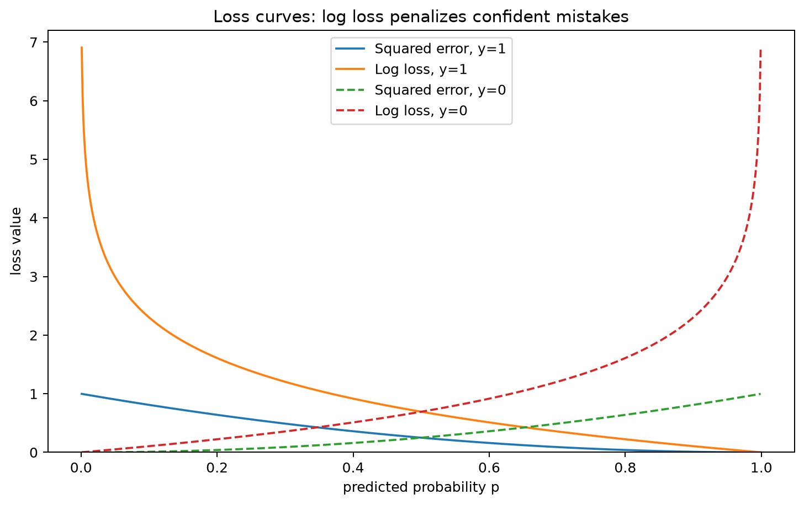
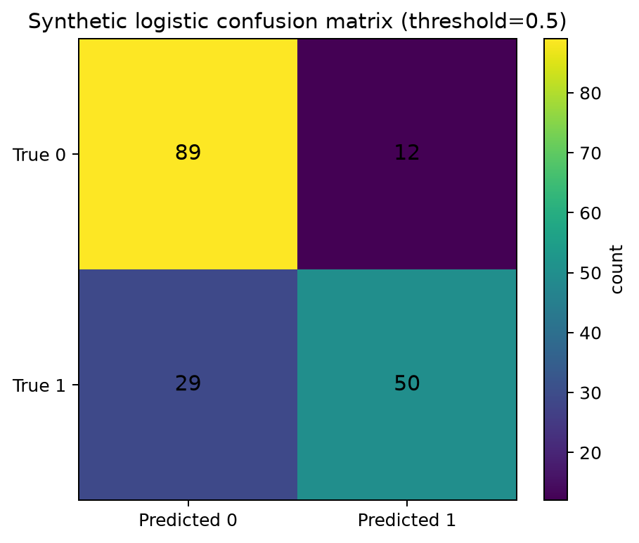
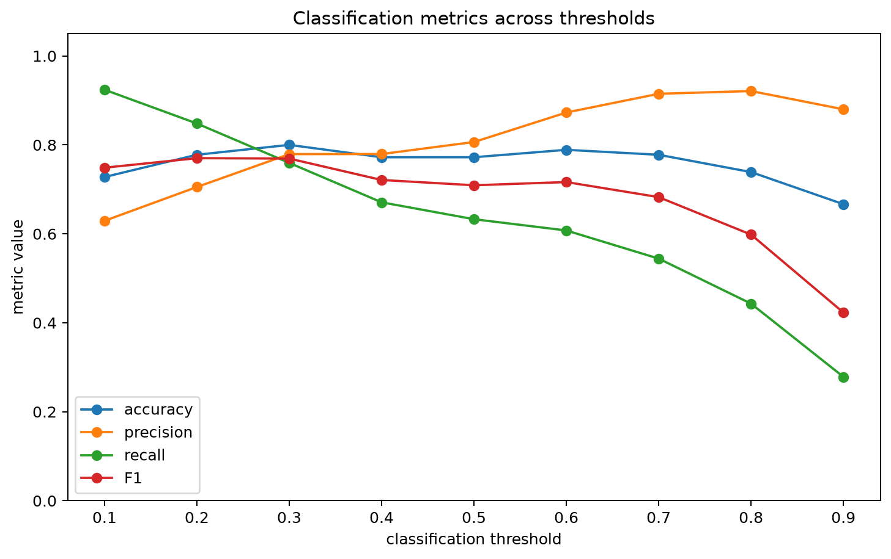

# Week15 阈值、混淆矩阵与 log loss 报告

## 1. Bernoulli、likelihood 与 log loss

### 1.1 Bernoulli 分布

$$
Y \sim Bernoulli(p)
$$

在二分类任务中，目标变量 `Y` 只有 0 和 1 两种取值。`p` 表示 `Y=1` 的概率，`1-p` 表示 `Y=0` 的概率。逻辑回归输出的不是普通连续值，而是这个 Bernoulli 概率参数 `p`。

### 1.2 单样本 likelihood

$$
L(p;y)=p^y(1-p)^{1-y}
$$

当真实标签 `y=1` 时，likelihood 变成 `p`；当真实标签 `y=0` 时，likelihood 变成 `1-p`。所以这个公式把两种类别统一写在一个表达式里。最大似然估计的思想就是让模型给真实结果分配尽可能高的概率。

### 1.3 单样本负对数似然 / log loss

$$
\ell(p;y)=-\left[y\log(p)+(1-y)\log(1-p)\right]
$$

对 likelihood 取负对数后，就得到单样本 log loss。模型如果给真实类别很低概率，log loss 会迅速变大。因此 log loss 很适合训练概率模型，尤其适合惩罚“错得很自信”的预测。

## 2. 损失函数图

这张图的横轴是预测为正类的概率 `p`，纵轴是 loss value。实线表示真实标签 `y=1`，虚线表示真实标签 `y=0`；图中同时比较 squared error 和 log loss。可以看到，当模型错得很自信时，比如 `y=1` 但 `p` 接近 0，或者 `y=0` 但 `p` 接近 1，log loss 的惩罚会远大于 squared error。

这说明二分类中概率预测不能只关心最后类别，也要关心模型对概率的自信程度。log loss 不是凭空指定的损失函数，而是来自 Bernoulli likelihood 的负对数形式。

## 3. 阈值 0.5 下的混淆矩阵和基础指标

| 指标 | 数值 |
|---|---:|
| TP | 50 |
| TN | 89 |
| FP | 12 |
| FN | 29 |
| accuracy | 0.7722 |
| precision | 0.8065 |
| recall | 0.6329 |
| F1 | 0.7092 |

## 4. Threshold 扫描结果

| threshold | TP | TN | FP | FN | accuracy | precision | recall | F1 |
|---|---|---|---|---|---|---|---|---|
| 0.1000 | 73.0000 | 58.0000 | 43.0000 | 6.0000 | 0.7278 | 0.6293 | 0.9241 | 0.7487 |
| 0.2000 | 67.0000 | 73.0000 | 28.0000 | 12.0000 | 0.7778 | 0.7053 | 0.8481 | 0.7701 |
| 0.3000 | 60.0000 | 84.0000 | 17.0000 | 19.0000 | 0.8000 | 0.7792 | 0.7595 | 0.7692 |
| 0.4000 | 53.0000 | 86.0000 | 15.0000 | 26.0000 | 0.7722 | 0.7794 | 0.6709 | 0.7211 |
| 0.5000 | 50.0000 | 89.0000 | 12.0000 | 29.0000 | 0.7722 | 0.8065 | 0.6329 | 0.7092 |
| 0.6000 | 48.0000 | 94.0000 | 7.0000 | 31.0000 | 0.7889 | 0.8727 | 0.6076 | 0.7164 |
| 0.7000 | 43.0000 | 97.0000 | 4.0000 | 36.0000 | 0.7778 | 0.9149 | 0.5443 | 0.6825 |
| 0.8000 | 35.0000 | 98.0000 | 3.0000 | 44.0000 | 0.7389 | 0.9211 | 0.4430 | 0.5983 |
| 0.9000 | 22.0000 | 98.0000 | 3.0000 | 57.0000 | 0.6667 | 0.8800 | 0.2785 | 0.4231 |

这张图的横轴是 classification threshold，纵轴是 metric value。四条曲线分别表示 accuracy、precision、recall 和 F1。一般来说，阈值升高时，模型更保守，预测为正类的样本减少，因此 precision 可能上升，但 recall 往往下降；阈值降低时，模型更容易报正类，recall 会提高，但 FP 也可能增加。

本次模拟数据中，F1 最高的阈值是 **0.2**，对应 F1 为 **0.7701**。这说明默认 0.5 并不一定是最适合所有业务目标的阈值。

## 5. 业务场景解释：疾病初筛

如果这是疾病初筛，我会更重视 **recall**。原因是漏掉真正有病的人（FN）通常比让健康人进一步复查（FP）更危险。因此，如果业务方目标是尽可能减少漏诊，我会建议选择比 0.5 更低的阈值，例如 0.3 或 0.4，并向业务方说明：这样会提高召回率，但也会带来更多假阳性，需要后续复查环节承接。

如果业务方的复查成本非常高，则可以把阈值调高，牺牲一部分 recall 来换更高 precision。因此阈值不是纯技术参数，而是业务成本权衡。
