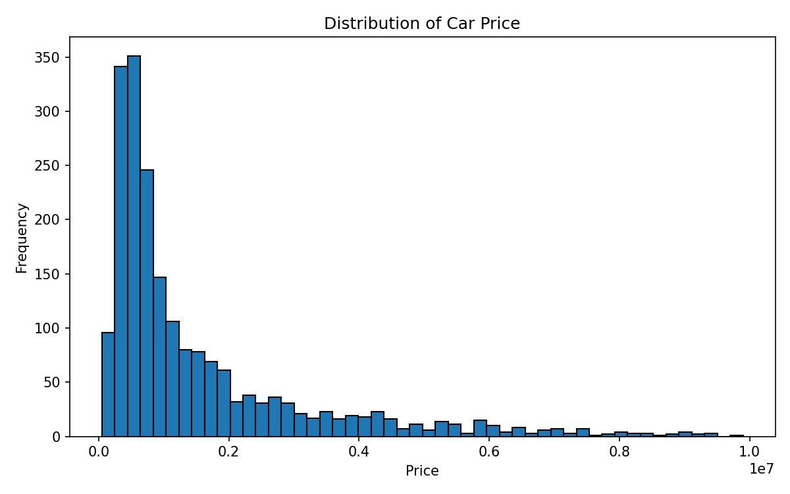
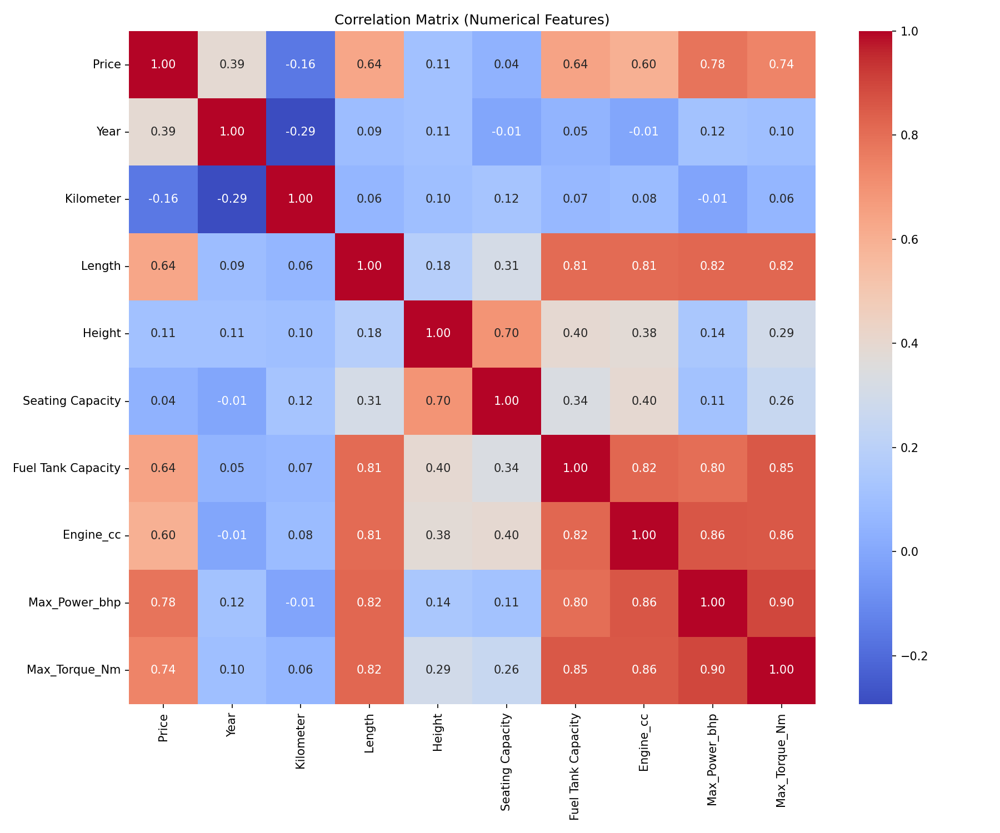
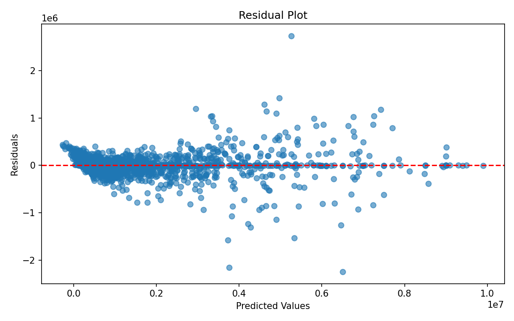

# Kaggle 二手车价格回归分析报告

## 数据集说明
- 数据集名称: Indian Car Price Dataset
- 来源: Kaggle (https://www.kaggle.com/datasets/nehalbirla/vehicle-dataset-from-cardekho)
- 下载日期: 2026-05-18
- 目标变量: Price（二手车价格，单位：印度卢比）
- 每一条样本代表一辆二手车的详细信息，包括年份、里程、燃料等
- 选择理由: 该数据集包含多种特征（数值+类别），有缺失值，量纲差异大，适合练习清洗、编码和无泄露评估。

## 变量说明（业务含义）

| 变量名（清洗后） | 类型 | 单位 / 取值 | 业务含义 |
|------------------|------|-------------|----------|
| **Price** | 目标变量 | 印度卢比 | 二手车价格（预测目标） |
| Year | 数值 | 年份 | 车辆生产年份，通常越新价格越高 |
| Kilometer | 数值 | 公里 | 已行驶里程，越高通常价格越低 |
| Engine_cc | 数值 | 立方厘米 (cc) | 发动机排量（从原始 `Engine` 列提取） |
| Max_Power_bhp | 数值 | 制动力 (bhp) | 最大功率（从原始 `Max Power` 列提取） |
| Max_Torque_Nm | 数值 | 牛米 (Nm) | 最大扭矩（从原始 `Max Torque` 列提取） |
| Length | 数值 | 毫米 (mm) | 车身长度 |
| Width | 数值 | 毫米 (mm) | 车身宽度 |
| Height | 数值 | 毫米 (mm) | 车身高度 |
| Seating Capacity | 数值 | 人数 | 座位数（如 5, 7） |
| Fuel Tank Capacity | 数值 | 升 (L) | 油箱容量 |
| Make | 类别 | 品牌名 | 汽车制造商（如 Maruti Suzuki, Hyundai） |
| Model | 类别 | 车型名 | 具体型号 |
| Fuel Type | 类别 | Petrol, Diesel, CNG, LPG, Electric | 燃料类型 |
| Transmission | 类别 | Manual, Automatic | 变速箱类型 |
| Location | 类别 | 城市名 | 销售地点（可能影响价格） |
| Color | 类别 | 颜色名 | 车身颜色 |
| Owner | 类别 | First, Second, Third, Fourth | 车主数（首次/多次过户） |
| Seller Type | 类别 | Individual, Corporate | 卖家类型（个人或企业） |
| Drivetrain | 类别 | FWD, RWD, AWD | 驱动方式 |

## 描述性统计
|       |            Price |    Year |   Kilometer |   Length |   Height |   Seating Capacity |   Fuel Tank Capacity |   Engine_cc |   Max_Power_bhp |   Max_Torque_Nm |
|:------|-----------------:|--------:|------------:|---------:|---------:|-------------------:|---------------------:|------------:|----------------:|----------------:|
| count |   2037           | 2037    |    2037     |  1973    |  1973    |            1973    |              1925    |     1957    |         1957    |         1957    |
| mean  |      1.53356e+06 | 2016.4  |   54595.2   |  4271.87 |  1591.32 |               5.31 |                51.67 |     1670.86 |          126.82 |          242.15 |
| std   |      1.68868e+06 |    3.35 |   57528.9   |   435.28 |   134.94 |               0.81 |                14.78 |      596    |           58.03 |          135.89 |
| min   |  49000           | 1988    |       0     |  3099    |  1281    |               2    |                15    |      624    |           35    |           48    |
| 25%   | 480000           | 2014    |   30000     |  3985    |  1485    |               5    |                41    |     1197    |           83    |          115    |
| 50%   | 825000           | 2017    |   50000     |  4355    |  1545    |               5    |                48    |     1497    |          115    |          200    |
| 75%   |      1.85e+06    | 2019    |   72000     |  4620    |  1675    |               5    |                60    |     1995    |          169    |          343    |
| max   |      9.9e+06     | 2022    |       2e+06 |  5265    |  1995    |               8    |               100    |     5461    |          500    |          700    |

## 关键变量图形

## 模型评估指标（5折无泄露交叉验证）
| 模型 | RMSE | MAE | MAPE (%) |
|------|------|-----|----------|
| GradientDescentOLS | 754637.86 | 422126.07 | 44.93 |
| sklearn LinearRegression (baseline) | 802034.09 | 507749.95 | 61.41 |

## 多重共线性诊断 (VIF)
- Year: VIF = 1.23
- Kilometer: VIF = 1.14
- Length: VIF = 4.89
- Height: VIF = 2.66
- Seating Capacity: VIF = 2.60
- Fuel Tank Capacity: VIF = 4.30
- Engine_cc: VIF = 7.06
- Max_Power_bhp: VIF = 9.13
- Max_Torque_Nm: VIF = 7.18
- 所有特征 VIF <= 10，共线性可接受

## 业务解释与风险
- MAE 约为 422126.0669478746 卢比，意味着平均预测误差为 42.21260669478746 万卢比。
- MAPE 约为 44.93%，表明相对误差较大，模型精度不够高。
- 最稳定的变量可能是 Year（车龄越新价格越高）、Kilometer（里程越低价格越高）。
- 变量如 Make、Model 虽然重要，但因为类别太多，编码后特征稀疏，可能不稳定。
- 主要风险：缺乏车辆实际状况（事故、维修记录）、地区差异大、模型泛化能力可能不足。
- 上线前建议收集更多特征（如车况评分），并考虑使用集成方法。
