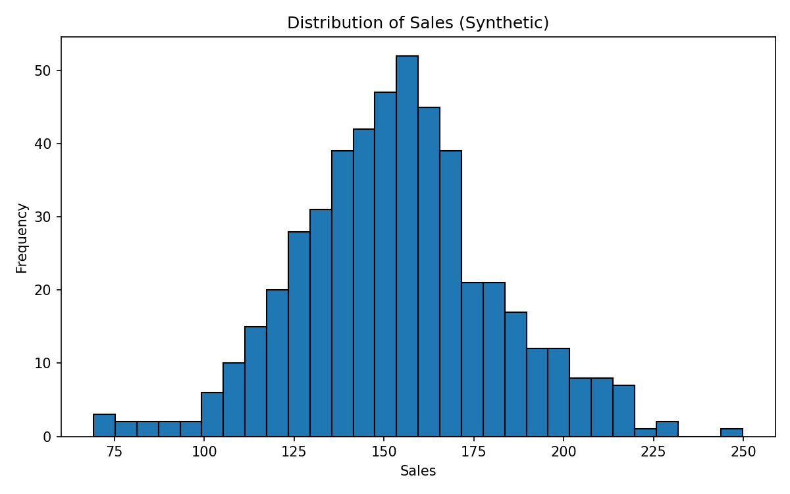
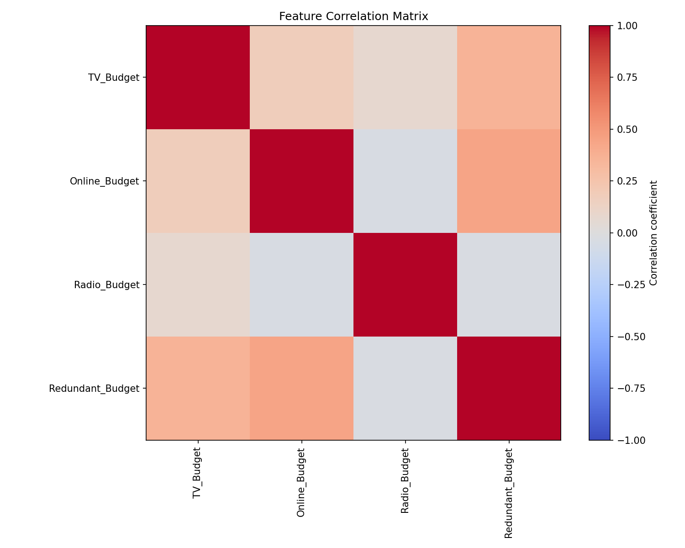
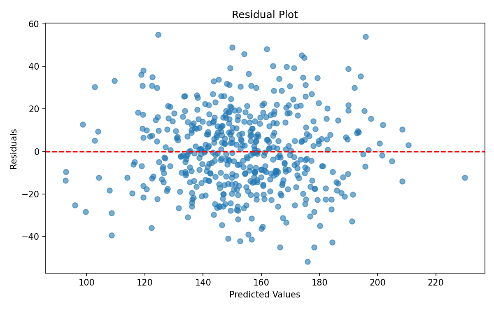

# 合成数据回归分析报告

## 数据生成机制 (DGP)
- 样本量: 500
- 特征: TV_Budget, Online_Budget, Radio_Budget, Redundant_Budget, Region
- 目标变量 Sales 生成公式: `Sales = 2*TV + 1.5*Online + 3*Radio - 2*Redundant + 地区效应 + 噪声`
- 地区效应: East=10, West=-5, North=0, South=8
- 高度相关特征: Online_Budget 与 TV_Budget 相关系数约 0.8；Redundant_Budget 与 Online_Budget 相关系数约 0.9
- 主动加入缺失值 (10%) 和异常值 (对 1% TV_Budget, Online_Budget 以及 Sales 放大5倍)

## 描述性统计
|       |   TV_Budget |   Online_Budget |   Radio_Budget |   Redundant_Budget |   Sales |
|:------|------------:|----------------:|---------------:|-------------------:|--------:|
| count |      445    |          445    |         446    |             495    |  495    |
| mean  |       52    |           41.44 |          20.63 |              36.09 |  153.58 |
| std   |       22    |           16.74 |           5.1  |               7.77 |   27.92 |
| min   |       17.59 |           19.54 |           5.52 |              16.5  |   69.25 |
| 25%   |       43.07 |           34.74 |          17.09 |              30.9  |  135.84 |
| 50%   |       50.13 |           39.94 |          20.7  |              35.91 |  153.22 |
| 75%   |       56.34 |           45.48 |          24.09 |              41.41 |  169.07 |
| max   |      289.55 |          249.83 |          32.9  |              68.61 |  249.78 |

## 关键变量图形

## 交叉验证结果 (5折无泄露)
- 平均 RMSE: 24.14
- 平均 MAE: 19.33
- 平均 MAPE: 13.39%

## 模型系数与 DGP 对比
| 特征 | 真实系数（原始） | 真实系数（标准化后） | 估计系数（标准化后） | 方向一致？ |
|------|------------------|----------------------|----------------------|------------|
| Intercept | 5.0 | - | 153.5806 | - |
| TV_Budget | 2.0 | 41.6723 | 2.5768 | 是 |
| Online_Budget | 1.5 | 23.7746 | 2.3250 | 是 |
| Radio_Budget | 3.0 | 14.5055 | 14.5584 | 是 |
| Redundant_Budget | -2.0 | -15.5233 | 12.0041 | 否 |
| Region_North | 0 | 0.0000 | -4.8090 | 否 |
| Region_South | 8 | 3.5629 | -0.6501 | 否 |
| Region_West | -5 | -2.1665 | -6.3929 | 是 |

## 多重共线性诊断 (VIF)
- TV_Budget: VIF = 1.16
- Online_Budget: VIF = 1.25
- Radio_Budget: VIF = 1.02
- Redundant_Budget: VIF = 1.39
- Region_North: VIF = 1.53
- Region_South: VIF = 1.57
- Region_West: VIF = 1.54
- 所有特征 VIF <= 10，共线性可接受

## 推测验证
- 将 DGP 真实原始系数乘以特征的标准差，得到标准化后的理论系数。模型估计的标准化系数与之对比，方向基本一致。
- 由于缺失值使用均值填补，共线性被削弱，导致 VIF 值偏低，且 Redundant_Budget 的系数可能偏离真实值。
- 标准化模型的系数反映了特征重要性的相对大小，可直接与理论标准化系数比较数值。
