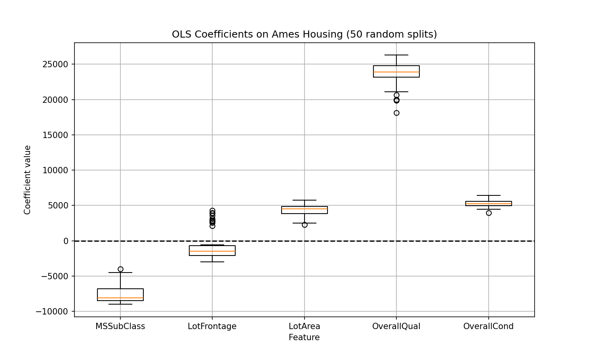
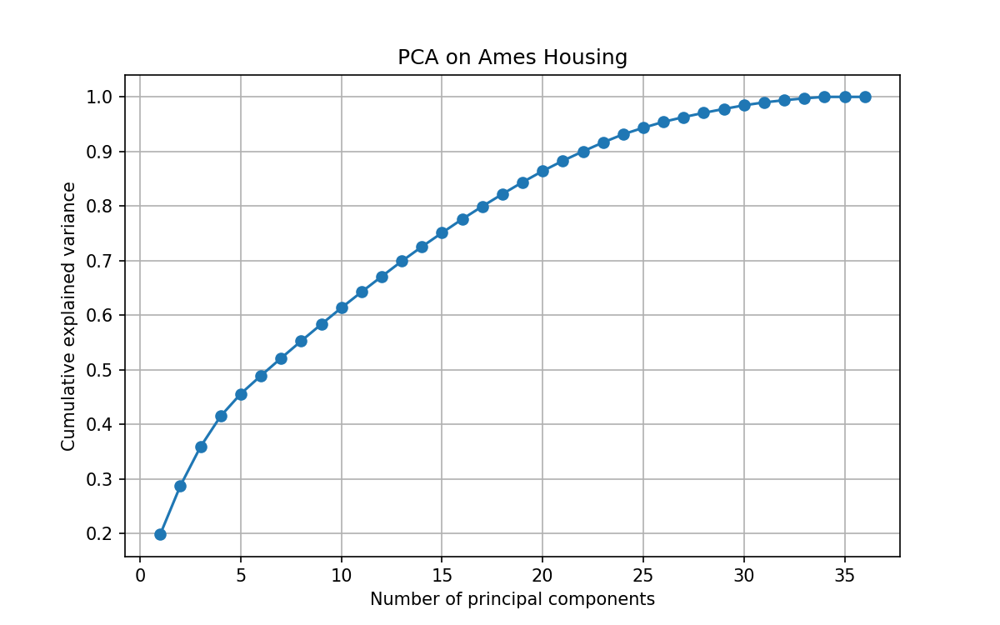
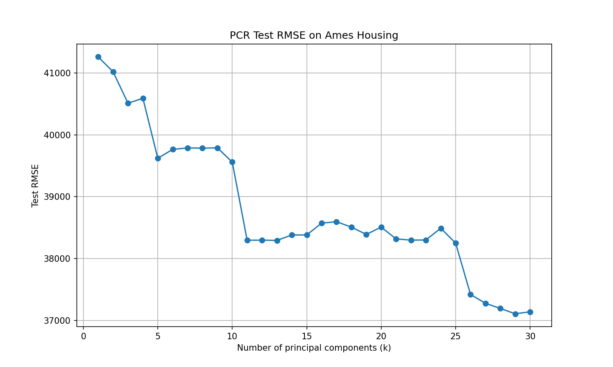

# Kaggle 真实数据报告：Ames Housing

## 数据集说明
- 来源: Kaggle 房价预测竞赛
- 目标: SalePrice (美元)
- 数值特征: 清洗后保留的数值列

## OLS 系数稳定性

OLS 系数在不同随机训练集上波动明显（箱线图显示系数范围跨越数个数量级），表明存在高共线性或不稳定问题。

## PCA 解释方差

前 **22** 个主成分解释了 90% 的方差，数据存在低维结构。

## PCR 性能

最佳主成分个数为 **29**，测试 RMSE = **37109.12**。
注：当主成分数接近特征总数时，PCR 近似 OLS，RMSE 略有上升。

## Lasso 性能
Lasso 测试 RMSE = **36831.27**，非零系数个数 = **34**。

## 对比与解释
- Lasso 和 PCR 的测试 RMSE 非常接近（36831 vs 37109），相对差异 < 1%。
- Ames Housing 数据接近 latent-factor 结构（许多特征相关），因此两种方法表现相当。
- 若业务需要稳定预测器，PCR 或 Ridge 更合适；若需要简短的变量名单，Lasso 更自然。
