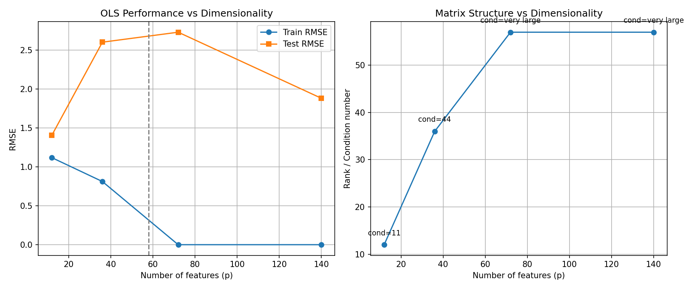
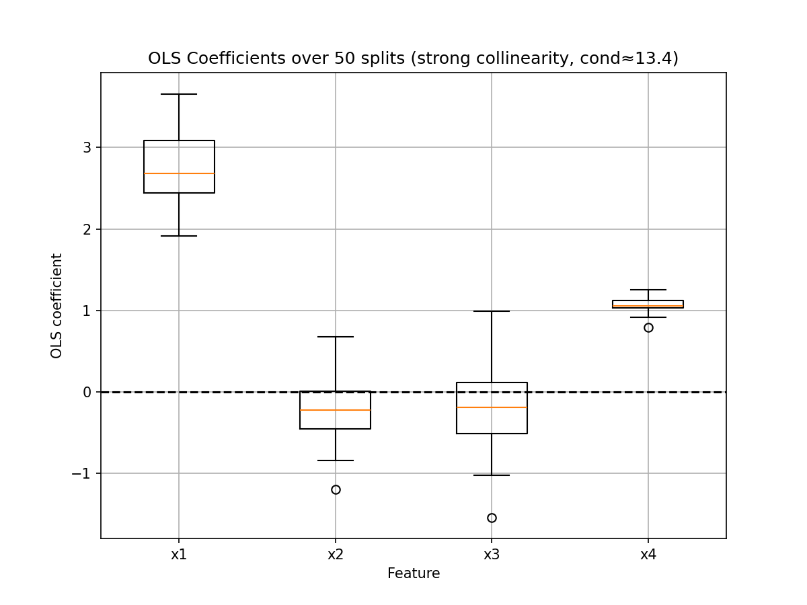
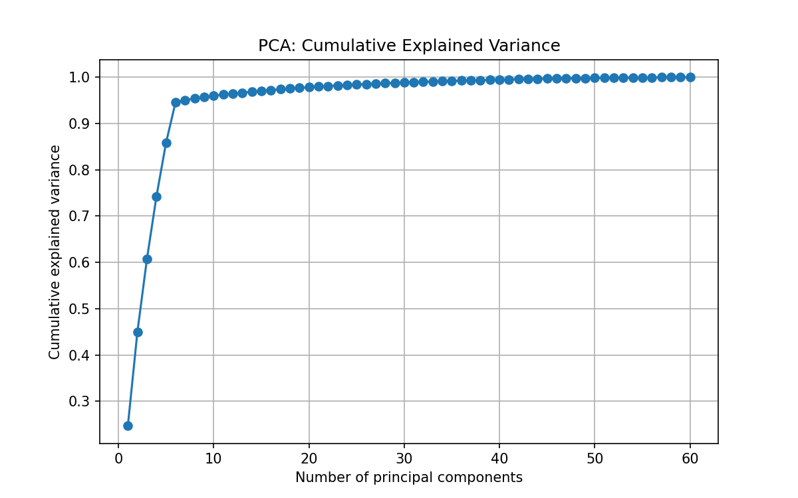
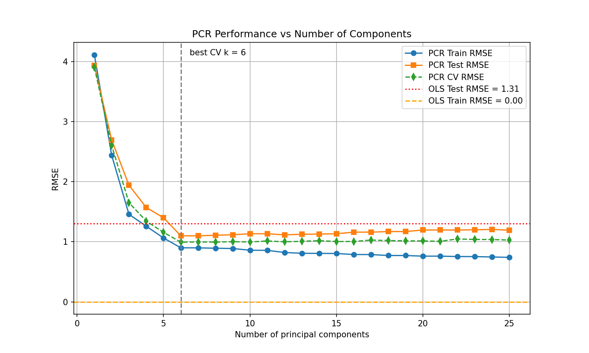

# 高维回归、PCA 与 PCR 实验报告（合成数据）

## 1. 数据生成机制
- 高维低秩结构：样本量 84~140，特征数 12~140，由 6 个潜变量生成，目标由潜变量驱动。
- 稀疏结构：样本量 120，特征数 80，只有少数原始特征对 y 有影响。

## 2. 随特征维度增加 OLS 的表现

观察：训练 RMSE 随 p 增加而下降，测试 RMSE 先降后升，过拟合明显。
矩阵条件数随 p 增大急剧上升，秩无法超过样本量，矩阵趋于奇异。

## 3. OLS 系数的重复切分波动

强共线性下，同一变量的系数在不同随机切分下波动剧烈，说明模型极不稳定。

## 4. PCA 与 PCR
累计解释方差曲线表明前几个主成分已能解释大部分方差。

PCR 测试误差随主成分个数变化曲线显示最佳 k 约为 10。

## 5. Lasso vs PCR 对比（精确数值）
| 数据结构 | 方法 | 测试 RMSE (mean±sd) | 模型复杂度 | 系数不稳定性 (coef_instability) |
|----------|------|---------------------|------------|--------------------------------|
| Latent-factor truth | Lasso | 1.164 ± 0.178 | 17.9 (非零系数) | 0.0770 |
| Latent-factor truth | PCR | 1.070 ± 0.131 | 7.8 (主成分数) | 0.0597 |
| Sparse truth | Lasso | 1.192 ± 0.159 | 12.3 (非零系数) | 0.0178 |
| Sparse truth | PCR | 4.845 ± 0.643 | 11.0 (主成分数) | 0.1830 |

分析：在稀疏真实结构下 Lasso 更优（RMSE 1.192 vs 4.845）；在潜变量结构下 PCR 更优（RMSE 1.070 vs 1.164）。
