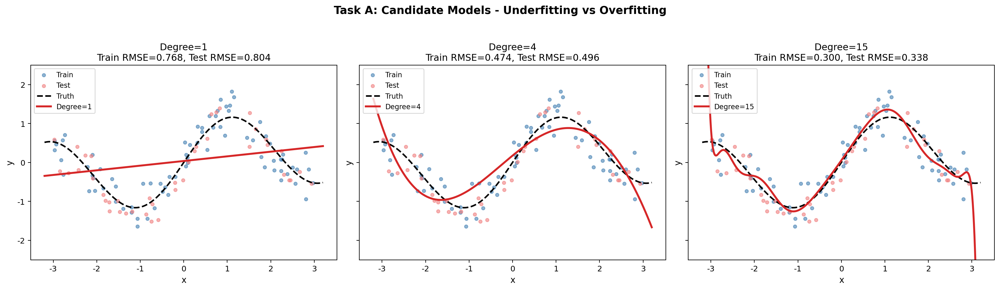
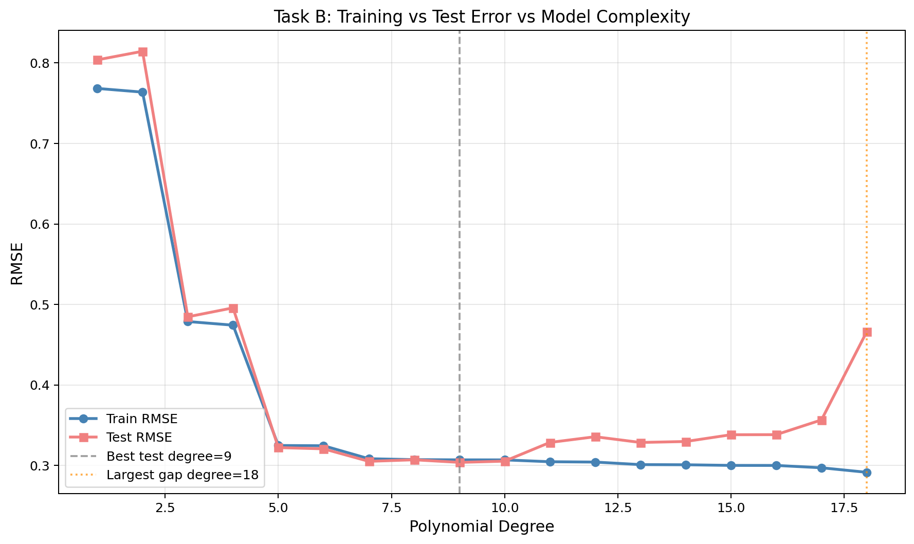
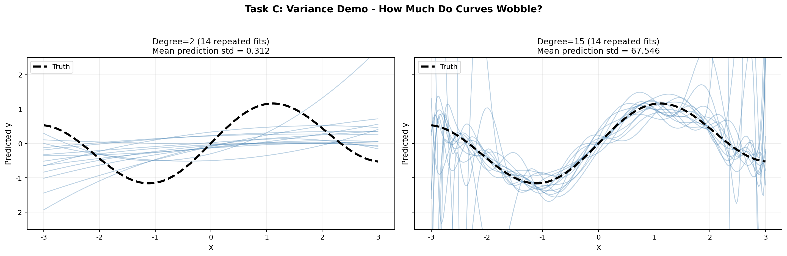
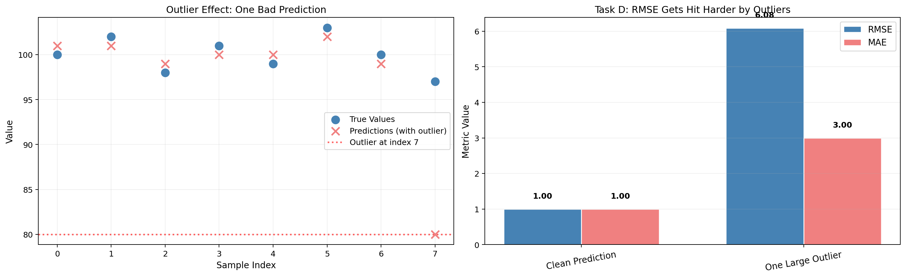

# Week 12 作业：偏差-方差可视化实验报告

## 实验配置

| 配置项 | 值 |
|--------|-----|
| 真实函数 | `sin(1.5*x) + 0.15*x` |
| 总样本量 | 120 |
| 训练集 | 78 |
| 测试集 | 42 |
| 噪声标准差 | 0.35 |
| 随机种子 | 20260523 |

---

## Task A：候选模型对比 (degree=1, 4, 15)

| degree | train_rmse | test_rmse |
|--------|-----------|-----------|
| 1 | 0.7683 | 0.8038 |
| 4 | 0.4742 | 0.4957 |
| 15 | 0.3000 | 0.3381 |

**分析：**
- **degree=1（欠拟合）**：训练误差=0.768，测试误差=0.804，两者都很高，模型过于简单，无法捕捉真实函数的波动。
- **degree=4（恰当拟合）**：训练误差=0.474，测试误差=0.496，两者都较低且接近，模型较好地平衡了偏差和方差。
- **degree=15（轻微过拟合）**：训练误差=0.300，测试误差=0.338，泛化差距=0.038。训练误差低于degree=4，但测试误差略高。相比Task B中degree=18的泛化差距0.175，这里的过拟合程度较轻，但仍显示出复杂模型泛化能力下降的趋势。

---

## Task B：完整复杂度扫描 (degree=1 到 18)

**最佳测试RMSE：** degree = 9  
**最大泛化差距（最严重过拟合）：** degree = 18

| degree | train_rmse | test_rmse | generalization_gap |
|--------|-----------|-----------|-------------------|
| 1 | 0.7683 | 0.8038 | 0.0355 |
| 2 | 0.7637 | 0.8145 | 0.0507 |
| 3 | 0.4788 | 0.4846 | 0.0059 |
| 4 | 0.4742 | 0.4957 | 0.0215 |
| 5 | 0.3247 | 0.3222 | -0.0026 |
| 6 | 0.3244 | 0.3206 | -0.0038 |
| 7 | 0.3083 | 0.3051 | -0.0033 |
| 8 | 0.3072 | 0.3070 | -0.0002 |
| 9 | 0.3069 | 0.3038 | -0.0031 |
| 10 | 0.3069 | 0.3053 | -0.0016 |

**分析：**
- 训练误差随复杂度增加持续下降
- 测试误差在degree=9处达到最优，之后开始上升
- 泛化差距在degree=18处最大（0.175），说明该模型严重过拟合
- 在degree=5到10之间出现泛化差距为负（测试误差低于训练误差），说明模型泛化良好

---

## Task C：方差可视化（重复抽样）

| degree | mean_prediction_std | max_prediction_std |
|--------|--------------------|--------------------|
| 2 | 0.3123 | 0.6945 |
| 15 | 67.5464 | 2225.6406 |

**分析：**
- **degree=2（低方差）**：14次重复抽样的拟合曲线几乎重合，预测标准差均值仅0.312
- **degree=15（高方差）**：曲线剧烈摆动，预测标准差均值高达67.55，最大值达2225.64，同一点在不同训练集上预测值差异极大

---

## Task D：RMSE vs MAE 对异常值的反应

| scenario | RMSE | MAE |
|----------|------|-----|
| Clean Prediction | 1.0000 | 1.0000 |
| One Large Outlier | 6.0828 | 3.0000 |

**分析：** RMSE从1.00增长到6.08（增长508%），MAE从1.00增长到3.00（增长200%）。RMSE对误差进行平方，大误差被放大；MAE使用绝对值，大误差仅线性增长。

---

## 必答问题

### 问题1：三条核心结论

1. **更低的训练误差不保证更好的泛化能力**。当模型复杂度超过9后，训练误差继续下降但测试误差开始上升，这是过拟合的本质。

2. **高方差模型在图上会剧烈抖动**。degree=15的拟合曲线在不同训练样本之间剧烈摆动（预测标准差均值67.55），而degree=2的曲线几乎重合（预测标准差均值0.312）。

3. **RMSE对异常值更敏感**。一个巨大预测错误使RMSE增长508%，而MAE仅增长200%。

### 问题2：最能代表过拟合的图

**`error_curves.png`（Task B的误差曲线图）**。这张图显示训练误差持续下降至接近0，而测试误差在degree=9后开始上升，两条曲线分道扬镳。特别是在degree=18处，泛化差距达到0.175，是过拟合最直观的证据。

### 问题3：指标选择判断

| 场景 | 推荐指标 | 原因 |
|------|---------|------|
| 大错误代价极高（自动驾驶、医疗诊断） | RMSE | 平方放大让模型更警惕大错误 |
| 数据天然包含较多异常值 | MAE | 异常值不会过度扭曲整体评估 |
| 所有误差同等重要（日常销售预测） | MAE | 更直观反映平均误差 |
| 需要突出惩罚大错误（金融风控） | RMSE | 大额误差被显著放大 |

### 问题4：与下一周的连接

高复杂度模型导致高方差，正则化（Ridge/Lasso）通过在损失函数中加入系数惩罚来控制方差：
- **Ridge（L2）**：限制系数大小，防止过大的系数导致不稳定
- **Lasso（L1）**：可将不重要系数压缩为零，实现特征选择

正则化允许使用高复杂度模型的同时控制方差，实现偏差-方差权衡。

---

*随机种子: 20260523*  
*评估函数来源: `src/utils/metrics.py`*
