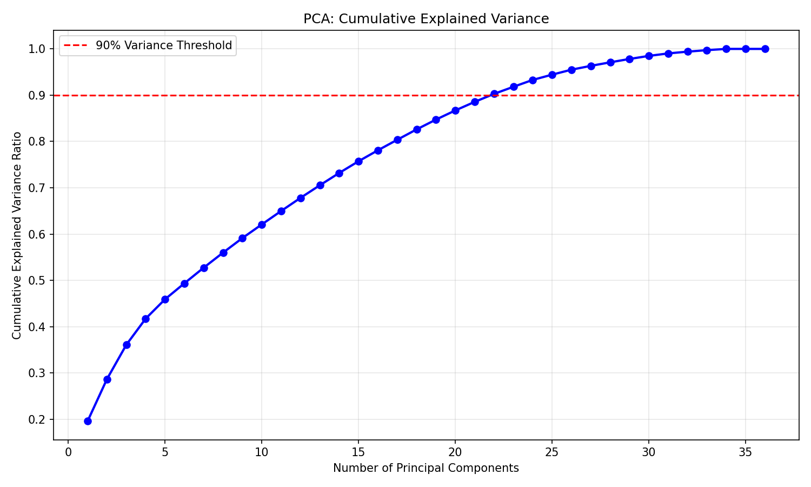
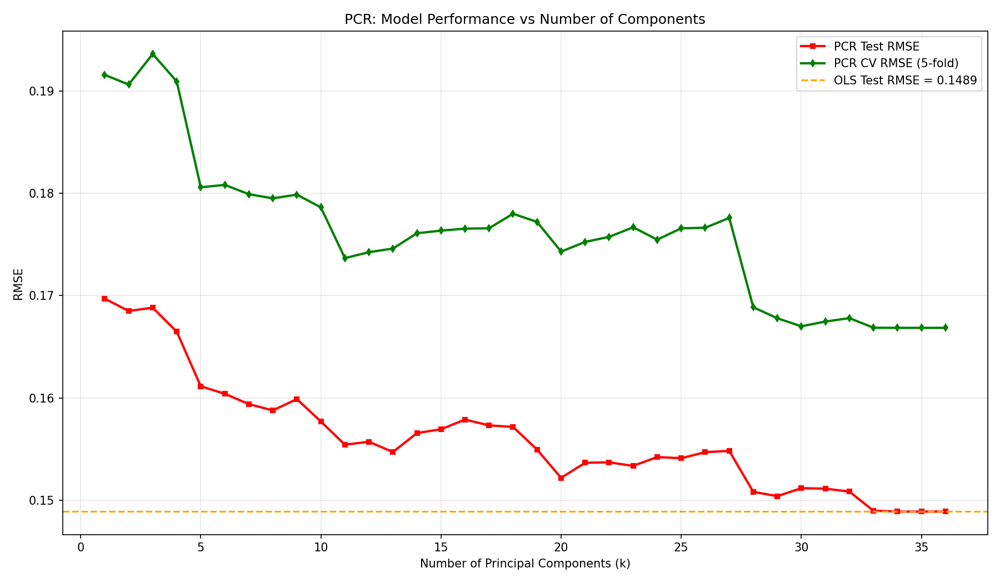

# Kaggle Housing Data: High-Dimensional Regression Analysis

## Dataset Info
- Source: Kaggle House Prices (Ames, Iowa)
- Target: SalePrice (log-transformed)
- Raw features: 79, After preprocessing: 36
- Sample size: 1460

## PCA Analysis

- PCs needed for 90% variance: 22
- Suggests latent low-dimensional structure (size factor, quality factor, location factor).

## Model Comparison
| Model | Test RMSE | Complexity |
|-------|-----------|------------|
| OLS | 0.1489 | 36 coefficients |
| Lasso | 0.1544 | 18 nonzero coefs |
| PCR | 0.1489 | 34 PCs |

## Lasso Feature Selection
Lasso reduced 36 features to 18 nonzero coefficients, indicating sparse structure.

## PCR Results

Optimal number of PCs: k=34

## Conclusion
- OLS shows overfitting risk in high-dim space.
- **Lasso performs better on this dataset**: achieves sparsity while maintaining good prediction.
- The data structure is more like sparse truth than pure latent-factor.
