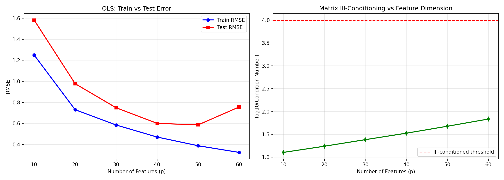
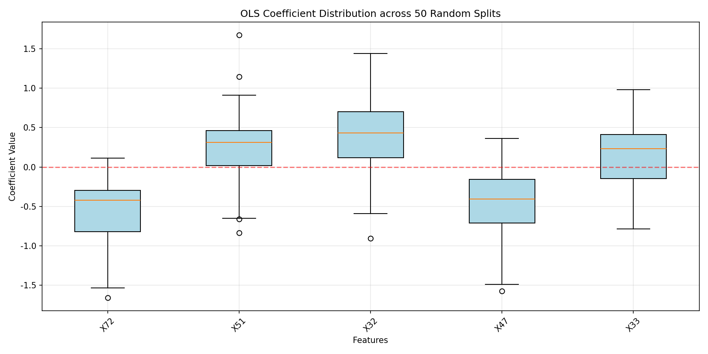
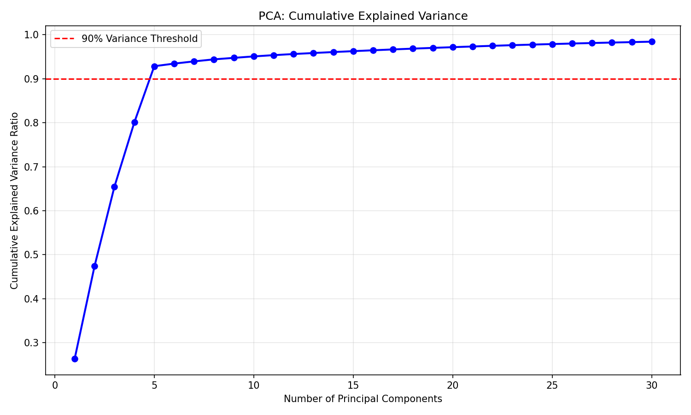
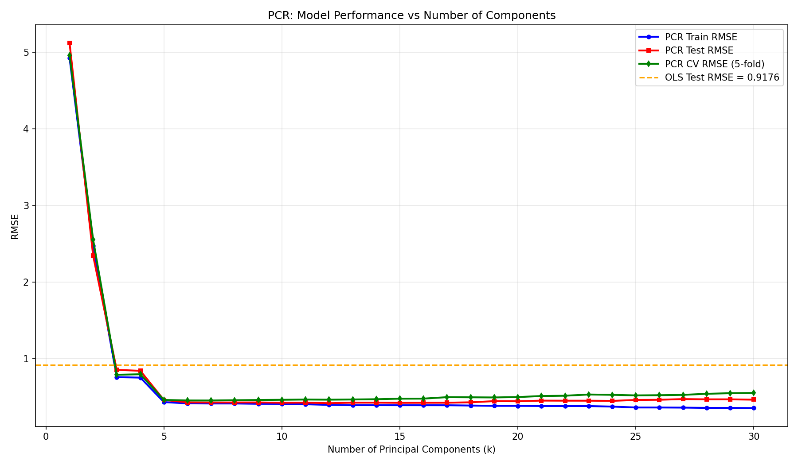

# Week 14: High-Dimensional Regression, PCA, and PCR Report

## 1. Data Generation
- Samples: 150, Features: 80
- Latent factors: 5
- High redundancy suitable for dimensionality reduction.

## 2. OLS Experiment

| p | train RMSE | test RMSE | log10(cond) |
|---|------------|-----------|-------------|
| 10 | 1.2506 | 1.5832 | 1.11 |
| 20 | 0.7305 | 0.9779 | 1.24 |
| 30 | 0.5851 | 0.7490 | 1.38 |
| 40 | 0.4705 | 0.6009 | 1.53 |
| 50 | 0.3879 | 0.5860 | 1.68 |
| 60 | 0.3244 | 0.7561 | 1.84 |

## 3. Coefficient Stability

## 4. PCA: 5 PCs needed for 90% variance

## 5. PCR Results

## 6. Formulas
- OLS: $\hat{\beta} = (X^TX)^{-1}X^Ty$
- First PC: $v_1 = \arg\max_{||v||=1} \text{Var}(Xv)$
- PCR: $Z_k = XV_k$, then $y = Z_k\gamma + \epsilon$
